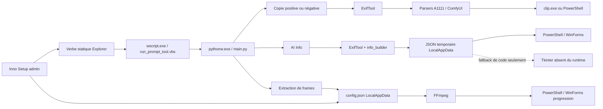

# Audit global — AI Metadata Inspector v1.3.2

> Audit réalisé le 9 août 2026.  
> Projet audité : `E:\AI\AI_Metadata_Inspector_V`.  
> Révision de travail : `589438705873e5e3e42e445ebf1a2f037e66b956` (`main`).  
> Livrable d’audit uniquement : aucune correction n’est implémentée dans ce document.

## Verdict global

**NO-GO pour une nouvelle release en l’état.** Aucun scénario de gravité **CRITIQUE** n’a été démontré de bout en bout, mais plusieurs défauts **HAUTS** touchent directement l’exactitude du parsing ComfyUI, l’intégrité des frames, la supervision FFmpeg, l’écriture de configuration, les mises à jour, la traçabilité de release et la sécurité des messages PowerShell. Les protections de base sont plutôt saines — processus lancés sans shell, outils natifs embarqués, runtime Python isolé, timeouts et allowlists — mais elles ne compensent pas ces défauts fonctionnels et de cycle de vie.

La prochaine version devrait être une **v1.3.3 issue d’un commit/tag exact et reproductible**, précédée d’un petit socle de tests de non-régression. Déplacer le tag `v1.3.2` existant serait une mauvaise solution.

## Résumé de la décision

- **À corriger impérativement avant la prochaine release :** provenance tag/binaire, primitive PowerShell, sortie ExifTool bornée avant allocation, erreurs de schéma/indices ComfyUI, sélection cohérente d’un sampler principal, suppression transactionnelle des frames, supervision FFmpeg, configuration UTF-8 et préservée, blocage du downgrade, contrat x64, erreurs visibles et sélection multiple Explorer.
- **Gains de vitesse réellement perceptibles :** supprimer le second appel ExifTool sur le chemin de copie, utiliser `ffmpeg -progress` au lieu de rescanner les frames, indexer le graphe ComfyUI une fois, réutiliser un snapshot de métadonnées et remplacer les processus clipboard par `CF_UNICODETEXT`.
- **Gains de sécurité réels :** retirer tout texte variable de `powershell.exe -Command`, borner stdout/stderr ExifTool, mettre FFmpeg à niveau, publier les frames via staging, maîtriser locks/processus enfants et limiter les graphes/GUI issus de métadonnées hostiles.
- **Simplifications structurantes :** un `GraphContext` ComfyUI canonique, un seul mapping sampler, un `MetadataSnapshot` par requête, deux profils subprocess Windows explicites, une source unique pour versions et menus, puis décision assumée sur le renderer GUI.
- **À ne pas toucher sans preuve supplémentaire :** `-fps_mode passthrough`, `-nostdin`, la whitelist FFmpeg, les listes d’arguments sans shell, l’isolation `python312._pth`, le principe des temporaires privés, et l’absence de service/cache persistant.

## Périmètre, méthode et limites

### Périmètre inspecté

- les 13 modules Python de premier niveau et leurs chemins critiques ;
- les quatre scripts PowerShell ;
- le lanceur VBS ;
- l’installateur Inno Setup, les scripts BAT/REG et l’outillage de release ;
- les binaires embarqués Python, FFmpeg et ExifTool ;
- le tag Git, le commit courant et l’asset GitHub publié ;
- les chemins « copie positive/négative », « AI Info » et « extraction de frames ».

### Vérifications effectuées

- lecture statique exhaustive des sources de premier niveau ;
- parsing AST des 13 fichiers Python : aucune erreur syntaxique ;
- parsing des quatre scripts PowerShell : aucune erreur syntaxique ;
- reproductions en mémoire, sans modifier les médias ni le presse-papiers :
  - crash sur `inputs` ComfyUI en liste ;
  - indices KSampler décalés ;
  - divergence fast/full ;
  - cycle de graphe menant à `RecursionError` ;
  - mélange sampler/seed entre plusieurs passes ;
  - interprétation des suffixes de `powershell.exe -Command` ;
  - corruption de texte UTF-8 lu par un PowerShell enfant en code page OEM ;
- mesures locales de latence ExifTool ;
- comparaison du tag, du commit courant, des dates et du digest de l’asset publié.

### Limites assumées

L’audit initial imposait une lecture seule stricte. En conséquence, aucun installateur n’a été exécuté, aucune clé Registre n’a été modifiée, aucun contenu n’a été placé dans le presse-papiers, aucune extraction FFmpeg réelle destructive n’a été lancée et aucune GUI n’a été validée visuellement. Les comportements UNC/SMB, junction/reparse point, AppLocker/WDAC, Windows 10 x86, Windows 11 ARM64, DPI multiples et interruption réelle d’installation restent à confirmer en VM. Les points correspondants sont signalés comme tels ; ils ne sont pas présentés comme des exploits démontrés.

## Architecture observée



Le découpage Python n’est pas excessivement monolithique et aucun cycle d’import évident n’a été trouvé. La difficulté principale est ailleurs : il existe plusieurs représentations partielles du même graphe ComfyUI, plusieurs mappings sampler, deux ordres de priorité prompt, deux GUI divergentes et trois implémentations proches des règles subprocess Windows. Cette duplication a déjà produit des résultats contradictoires.

## Table priorisée des constats

| ID | Priorité | Domaine | Fichier(s) | Problème | Impact concret | Recommandation |
|---|---|---|---|---|---|---|
| REL-01 | HAUTE | Release | tag `v1.3.2`, `main.py`, `info_window.py`, `run_prompt_tool.vbs` | Le tag source et l’asset v1.3.2 publié ne représentent pas le même état du code | Build non reproductible, diagnostic et support sur une mauvaise source | Publier v1.3.3 depuis un commit/tag exact ; manifeste commit/hash/SBOM |
| REL-02 | HAUTE | Qualité | projet entier | Aucun test projet ni gate automatisée visible | Les erreurs KSampler, fast/full, seed 0 et installer ont pu être publiées | Ajouter fixtures et tests ciblés avant tout refactor |
| REL-03 | MOYENNE | Supply chain | `AI_Metadata_Inspector.iss`, `tools/generate_checksum.ps1`, release GitHub | Setup audité non signé ; checksum manuel absent de la release | Faible authentification éditeur et contrôle d’intégrité non automatisé | Signature Authenticode, hash/SBOM joints et vérifiés en CI |
| SEC-01 | HAUTE | Sécurité / erreurs | `main.py:74-96`, `info_window.py:18-38` | Texte variable interprétable après `powershell.exe -Command` | Dialogues cassés et primitive d’exécution PowerShell confirmée | Utiliser `MessageBoxW` ou un script fixe alimenté par stdin |
| SEC-02 | HAUTE | DoS mémoire | `exif_reader.py:184-231` | Le plafond 2 Mo est contrôlé après `capture_output=True` | Une métadonnée hostile peut épuiser la mémoire avant la garde | Lire stdout/stderr en binaire avec plafonds et tuer au dépassement |
| DEP-01 | HAUTE | Dépendances natives | `ffmpeg.exe`, `frame_extractor.py:208-232` | FFmpeg 8.1 précède les correctifs de sécurité 8.1.2 | Décodage d’un MP4 hostile par une bibliothèque native non à jour | Mettre à jour après tests codecs et automatiser la veille CVE |
| SEC-03 | MOYENNE | Durcissement | `exif_reader.py`, lanceurs Windows | Config ExifTool utilisateur et exécutables système non qualifiés | Comportement non déterministe ; planting conditionnel au CWD | `-config ""`, `--`, chemins System32 et `cwd` maîtrisé |
| PAR-01 | HAUTE | ComfyUI | `prompt_extractors.py:107-154`, `workflow_parser.py:34` | `extract_text_from_prompt_node()` suppose `inputs` dictionnaire | Workflow UI standard : `AttributeError`, prompt absent ou AI Info en échec | Normaliser les formes API/UI avant toute extraction |
| PAR-02 | HAUTE | ComfyUI moderne | `workflow_utils.py:23-34`, `workflow_resolver.py:157-251`, `workflow_extractors.py` | Liens UI, `widgets_values` objet, reroutes et inputs convertis mal gérés | Valeurs liées ignorées ou mauvais nœud résolu | Construire une fois index nœuds/liens et résolveur typé/borné |
| PAR-03 | HAUTE | Exactitude sampler | `workflow_extractors.py:228-249`, `workflow_seed.py:133-155`, `workflow_parser.py:82-89` | Indices KSampler décalés d’un widget | Steps/CFG/sampler/scheduler faux mais présentés comme valides | Un mapping sampler canonique testé par type/version |
| PAR-04 | HAUTE | Prompts | `prompt_extractors.py:224-308` | Polarité déduite du titre « negative », pas des arêtes du sampler | Prompt négatif perdu ; positif choisi selon l’ordre JSON | Remonter depuis les entrées positive/négative du sampler final |
| PAR-05 | HAUTE | Fast/full | `prompt_extractors.py:399-482` | Le fast path préfère le texte libre, le full path le JSON | La même action peut copier un commentaire au lieu du prompt | Mutualiser priorité et algorithme ; structuré avant générique |
| PAR-06 | HAUTE | Multi-sampler / seed | `workflow_seed.py:212-319`, `workflow_parser.py:82-89` | Tri par steps croissants, seed 0 écartée et champs fusionnés entre passes | Résumé hybride ne correspondant à aucun sampler réel | Sélectionner une passe, puis prendre tous ses champs ; seed 0 valide |
| PAR-07 | HAUTE | Workflows modernes | `workflow_extractors.py`, `workflow_resolver.py` | `SamplerCustom*`, Flux/SDXL, dimensions/FPS de branche finale incomplets | Infos absentes ou issues d’une branche preview/inactive | Adaptateurs explicites et traversée depuis l’output sauvegardé |
| PAR-08 | MOYENNE | Données hostiles | `prompt_extractors.py`, `workflow_resolver.py`, `workflow_utils.py` | Validation JSON faible, cycles/profondeur/budgets incomplets | `RecursionError`, O(N²), très grande GUI, confiance sur données mixtes | Budgets, `visited`, validation structurelle et provenance |
| META-01 | MOYENNE | Exif/A1111 | `exif_reader.py`, `prompt_extractors.py` | Groupes Exif perdus ; `Steps:` seul ou prompts courts mal classés | Collision de tags et faux positif/faux négatif | Sortie groupée/normalisée et règles dépendantes du tag |
| PERF-01 | MOYENNE | Performance | `main.py:182-247`, `exif_reader.py:294-323` | Le repli fast→full relance ExifTool sur les mêmes tags textuels | Environ 140–200 ms gaspillées sur le cas sans résultat | Réutiliser le même snapshot ; gain **important** |
| FRM-01 | HAUTE | Intégrité données | `frame_extractor.py:96-107,380-444` | Suppression de tout `frame_*.png` sans preuve d’appartenance | Perte de fichiers utilisateur ou de la dernière extraction valide | Staging unique, manifeste/marqueur, publication après succès |
| FRM-02 | HAUTE | GUI / supervision | `frame_extractor.py:26-34,317-428` | WinForms reçoit `SW_HIDE` ; échec fenêtre traité après attente FFmpeg | Extraction invisible, annulation impossible, résultat supprimé | Profil GUI visible et supervision simultanée des deux processus |
| FRM-03 | HAUTE | Timeout / processus | `frame_extractor.py:235-444` | Timeout 24 h inopérant tant que la fenêtre bloque ; aucun Job Object | Attente indéfinie et processus orphelins après crash | Watchdog absolu, `kill+wait`, Job Object `KILL_ON_JOB_CLOSE` |
| FRM-04 | HAUTE | Locks / concurrence | `frame_extractor.py:57-93,380-388` | Lock persistant 6 h, PID non validé, chemins d’erreur avant `finally` | Extraction refusée après crash ; lock abandonné | Verrou OS détenu, identité propriétaire et `finally` immédiat |
| FRM-05 | HAUTE | Erreurs / capacité | `frame_extractor.py`, `run_prompt_tool.vbs:34-41` | stderr FFmpeg jeté, code non transmis à l’UI, pas de garde disque | Faux « completed », échecs disque/codec/permission silencieux | stderr borné, statut partagé, préflight disque et erreur visible |
| FRM-06 | MOYENNE | Progression / VFR | `ps/frame_extract_window.ps1:55-71,221-268`, `frame_extractor.py:133-205` | Scan complet toutes les 500 ms ; total FPS×durée approximatif/non borné | Coût quasi quadratique, UI bloquée, pourcentage faux | `ffmpeg -progress`, `math.isfinite`, bornes Int32/marquee |
| GUI-01 | HAUTE | Résilience | `info_window.py:162-179`, `info_window_py.py`, `README.md:23` | PowerShell est primaire ; fallback Tk annoncé mais absent du bundle | AI Info indisponible sous politique PowerShell restrictive | Choisir le contrat ; livrer/tester Tcl/Tk si fallback requis |
| GUI-02 | MOYENNE | GUI hostile | `ps/info_window_layout.ps1`, `ps/info_window_helpers.ps1` | Preview pleine résolution et nombre de cartes/prompts sans plafond | Freeze/OOM ou fenêtre inutilisable sur métadonnées hostiles | Limites pixels/temps/cartes, rendu progressif et copie intégrale séparée |
| GUI-03 | MOYENNE | GUI / DPI / parité | scripts GUI PowerShell, `info_window_py.py` | Layout fixe, champs et erreurs différents, version WinForms 1.3.1 | Résultat dépend du renderer ; clipping à fort DPI | Schéma de vue partagé, tests de parité/DPI, version unique |
| GUI-04 | MOYENNE | Clipboard | `main.py:99-142` | Fallback PowerShell lit l’UTF-8 en code page OEM | Accents, CJK et emoji corrompus ; succès non vérifié | Win32 `CF_UNICODETEXT` avec retries |
| INS-01 | HAUTE | Unicode / config | `AI_Metadata_Inspector.iss:666-705`, `app_config.py:60-78` | Inno écrit une `AnsiString`, Python relit en UTF-8 | Chemin André/CJK/emoji corrompu ; extraction au mauvais endroit | Écrire UTF-8 sans BOM, vérifier et remplacer atomiquement |
| INS-02 | HAUTE | Update / config | `AI_Metadata_Inspector.iss:527-602,666-713` | Update/Modify ne charge pas la config puis l’écrase par défaut | Préférence et dossier de frames réinitialisés silencieusement | Précharger ou préserver byte-for-byte sans changement explicite |
| INS-03 | HAUTE | Installation multi-utilisateur | `AI_Metadata_Inspector.iss` | Setup admin global mais `{localappdata}` dépend du compte élevé | Menus globaux et configuration du mauvais utilisateur | Installation par utilisateur ou initialisation au premier lancement |
| INS-04 | HAUTE | Downgrade | `AI_Metadata_Inspector.iss:308-334,452-472`, `[Files]` | Une version plus récente peut être écrasée via « Modify » | Mélange/downgrade silencieux des binaires | Comparer `<`, `=`, `>` et bloquer/faire confirmer le downgrade |
| CTX-01 | HAUTE | Explorer | `AI_Metadata_Inspector.iss:105-132` | Aucun `MultiSelectModel=Single` | Jusqu’à N processus, courses clipboard, fenêtres et collisions frames | Déclarer `Single` pour chaque action mono-fichier |
| INS-05 | MOYENNE | Menus legacy | `install_context_menu.bat`, `uninstall_context_menu.bat` | `%1` au lieu de `%%1` ; script manuel installé mais cassé | Menu manuel reçoit un chemin vide ou figé | Retirer le chemin legacy ou le générer/tester depuis la source canonique |
| INS-06 | MOYENNE | Transaction install | `AI_Metadata_Inspector.iss:244-378,660-663` | Menus supprimés avant copie ; détection/uninstaller trop permissifs | Installation interrompue laisse l’ancienne version sans menus | Modifier après succès/rollback ; valider AppId/publisher/path |
| INS-07 | HAUTE | Compatibilité Windows | `AI_Metadata_Inspector.iss`, `README.md` | Payload exclusivement x64 sans `ArchitecturesAllowed` ni prérequis documenté | Setup accepté sur Windows x86 puis application inutilisable | `ArchitecturesAllowed=x64compatible` et matrice x64/ARM64 |
| ROB-01 | HAUTE | Robustesse / UX | `main.py`, `run_prompt_tool.vbs:34-41`, `exif_reader.py` | Les codes hors `info` sont silencieux et plusieurs causes deviennent « aucun tag » | Presse-papiers ancien collé, extraction échouée sans explication | Résultat structuré et une couche unique de notification |
| ROB-02 | MOYENNE | Robustesse | `app_config.py`, `main.py:16` | Config invalide → défaut silencieux ; imports eager couplent les modes | Écriture inattendue et panne d’un mode qui casse les autres | Distinguer absent/invalide, conserver last-good, imports par branche |
| PRIV-01 | MOYENNE | Confidentialité | `main.py:53-71`, `info_window.py:43-136`, `AI_Metadata_Inspector.iss:96-103` | `ai_info_error.log` contient les chemins même en succès, sans rotation/uninstall | Historique privé persistant et croissance illimitée | Erreurs seulement, rotation/redaction et suppression ciblée |
| ARC-01 | MOYENNE | Architecture | parsers ComfyUI | Index, résolution, mapping sampler et provenance sont dupliqués | Chaque nouveau node multiplie les modifications et divergences | `GraphContext` + adaptateurs + `SamplerPass` canoniques |
| ARC-02 | MOYENNE | Architecture Windows | GUI, subprocess, menus, version | Politiques répétées dans plusieurs langages/fichiers | Risque de divergence déjà matérialisé | Services Windows et sources de build uniques |

**Lecture des priorités :**

- **CRITIQUE** : compromission ou perte massive démontrée sans précondition raisonnable. Aucun constat n’atteint ce niveau avec les preuves actuelles.
- **HAUTE** : bloque la prochaine release, car touche une fonction critique, l’intégrité, la sécurité ou l’upgrade.
- **MOYENNE** : correction utile à planifier juste après le socle P0.
- **FAIBLE** : entretien ou défense en profondeur, sans gain utilisateur immédiat.

# 1. Bugs et risques réels

## 1.1 Release, reproductibilité et qualité

### REL-01 — le « v1.3.2 » publié n’est pas la source taguée v1.3.2

1. **Comportement actuel.** Le tag distant `v1.3.2` pointe sur `75412dcfb13285aa82ec01ea6b2c5e627a0d9f77` (« Release AI Metadata Inspector 1.3.2 »). La copie auditée est `589438705873e5e3e42e445ebf1a2f037e66b956`, commit ultérieur « Fix AI info window launch ». Le diff porte sur `main.py`, `info_window.py` et `run_prompt_tool.vbs` : 230 ajouts et 55 suppressions. La release a été publiée à 21:37:02Z ; l’asset courant a été créé à 22:08:52Z, après le correctif à 22:08:12Z. Son digest correspond exactement au setup local : `sha256:8d6b01b84187c1222067900f97610e0714e5f3d825ea898f260d0554159ca86b`, 46 002 388 octets.
2. **Pourquoi c’est un problème.** Le checkout du tag ne permet pas de reconstruire ou d’expliquer le binaire distribué. L’ancienne source conserve notamment un timeout GUI et des options de masquage différents.
3. **Scénario concret.** Un mainteneur corrige un bug sur la base du tag, reproduit un comportement différent de l’EXE téléchargé, puis publie une correction incomplète.
4. **Recommandation.** Ne pas déplacer le tag existant. Publier une v1.3.3 depuis un commit propre, tag annoté/signé, build CI déclenché uniquement depuis ce tag, avec commit, version des outils, hashes et SBOM dans un manifeste. Interdire le remplacement ambigu d’un asset attaché à un tag immuable.
5. **Risque de régression.** Faible pour le produit ; moyen pour le pipeline s’il faut migrer la procédure de signature.
6. **Gain attendu.** Très important : reproductibilité, support et audit supply-chain.

La [release v1.3.2 GitHub](https://github.com/Gaurox/AI-Metadata-Inspector/releases/tag/v1.3.2) ne contient qu’un EXE et aucun fichier `.sha256`, contrairement à `README.md:151`. Le présent audit porte donc sur **le commit `5894387` et l’asset de digest ci-dessus**, pas sur la seule archive source du tag `75412dc`.

### REL-02 / REL-03 — absence de filet de tests et publication insuffisamment attestée

1. **Comportement actuel.** Aucun test projet n’a été trouvé. `tools/generate_checksum.ps1` est manuel et peut signer logiquement un ancien fichier si le workflow n’est pas strict. Le setup local correspondant à l’asset publié n’a pas de signature Authenticode ; FFmpeg et ExifTool sont eux aussi non signés, tandis que le Python PSF est signé.
2. **Pourquoi c’est un problème.** Les défauts reproduits sont précisément ceux que des fixtures simples auraient arrêtés : un widget ajouté, une seed égale à zéro, un workflow UI au lieu d’un prompt API, ou un update sur version plus récente.
3. **Scénario concret.** Un asset est remplacé après le tag ; le hash absent de la page de release et l’absence de manifeste empêchent l’utilisateur de relier l’EXE au commit.
4. **Recommandation.** Introduire des tests unitaires/fixtures avant les changements structurels, puis un gate release : checkout propre du tag, tests, build, smoke test VM, signature, SBOM, hash, upload immuable et vérification du digest téléchargé.
5. **Risque de régression.** Faible ; risque initial de faux positifs si les fixtures ne décrivent pas les variantes ComfyUI.
6. **Gain attendu.** Important sur la fiabilité de chaque release ; pas de gain runtime.

## 1.2 Sécurité des processus et dépendances

### SEC-01 — primitive d’interprétation PowerShell dans les dialogues d’erreur

1. **Comportement actuel.**
   - `main._show_visible_error()` lance `powershell.exe -Command <script> <message> <titre>` et suppose que les deux derniers arguments seront dans `$args`.
   - Avec Windows PowerShell 5.1, les éléments placés après la chaîne de `-Command` sont concaténés/interprétés comme du code ; la reproduction a donné `$args.Count = 0` et un suffixe `x; Write-Output POWERSHELL_SUFFIX_EXECUTED` a bien exécuté la seconde commande.
   - `info_window._write_visible_error()` interpole `message!r` et `title!r` dans le source PowerShell. Le quoting Python n’est pas un quoting PowerShell.
   - Le helper de `main.py` applique en plus le profil de fenêtre cachée ; une MessageBox peut être invisible puis bloquer jusqu’au timeout.
2. **Pourquoi c’est un problème.** Les dialogues sont déjà mal alimentés et constituent un sink d’exécution de code. Le contenu d’erreurs, de tracebacks ou de chemins ne doit jamais devenir du source PowerShell.
3. **Scénario concret.** Une exception inclut un chemin ou un texte comportant apostrophe, point-virgule ou `$()` ; le helper interprète une partie du texte sous l’identité de l’utilisateur.
4. **Recommandation.** Utiliser directement `ctypes.windll.user32.MessageBoxW`. À défaut, exécuter un script `-File` fixe et transmettre les deux chaînes par stdin JSON/Base64. Réserver `CREATE_NO_WINDOW` aux consoles enfants, sans `STARTF_USESHOWWINDOW` pour une GUI.
5. **Risque de régression.** Faible avec `MessageBoxW` ; tester parentage, topmost, Unicode et session non interactive.
6. **Gain attendu.** Important en sécurité et en fiabilité des erreurs.

La primitive est **confirmée**, mais aucune chaîne complète « PNG/MP4 hostile → texte choisi intact → helper » n’a été démontrée pendant cet audit. Elle est donc classée **HAUTE**, et non CRITIQUE. Le comportement de `powershell.exe -Command` est documenté par [Microsoft](https://learn.microsoft.com/fr-fr/powershell/module/microsoft.powershell.core/about/about_powershell_exe?view=powershell-5.1).

### SEC-02 — la limite ExifTool arrive après l’allocation

1. **Comportement actuel.** `exif_reader.py:184-231` utilise `subprocess.run(..., capture_output=True, text=True)`, accumule stdout et stderr, applique `strip()`, puis contrôle seulement ensuite si stdout dépasse 2 000 000 caractères.
2. **Pourquoi c’est un problème.** Le processus Python a déjà alloué les octets, leur décodage, des copies de chaînes puis potentiellement l’arbre JSON. Le timeout de 20 secondes ne borne pas une sortie très volumineuse produite rapidement ; stderr est également non borné.
3. **Scénario concret.** Un PNG contient un champ sélectionné exceptionnellement volumineux. ExifTool l’émet en quelques secondes ; Python consomme plusieurs fois sa taille avant de rejeter le résultat.
4. **Recommandation.** Utiliser `Popen` en mode binaire, drainer stdout/stderr de façon concurrente avec un plafond en octets, tuer et `wait` dès dépassement, puis décoder/`json.loads`. Conserver une limite sémantique distincte pour la valeur utile.
5. **Risque de régression.** Moyen : ne pas tronquer silencieusement un workflow légitime et éviter tout deadlock de pipe.
6. **Gain attendu.** Important contre le déni de service local ; latence neutre.

### DEP-01 — FFmpeg embarqué antérieur à des correctifs de sécurité

1. **Comportement actuel.** Le binaire réellement embarqué est `ffmpeg 8.1-essentials_build-www.gyan.dev` x64, `libavcodec 62.28.100`. Il correspond à `THIRD_PARTY_NOTICES` ; une ancienne observation d’un build 2025 venait d’un `ffmpeg.exe` résolu via `PATH` et ne doit pas être retenue.
2. **Pourquoi c’est un problème.** La branche officielle 8.1.2, `libavcodec 62.28.102`, inclut des correctifs annoncés pour CVE-2026-8461 et CVE-2026-30999. L’application décode précisément des MP4 potentiellement non fiables.
3. **Scénario concret.** L’utilisateur choisit « Extract frames » sur un fichier construit pour déclencher un défaut du décodeur natif avant que les validations applicatives ne puissent intervenir.
4. **Recommandation.** Passer au minimum à une build stable contenant 8.1.2, enregistrer URL/hash/version exacte, puis rejouer les fixtures codecs, CFR/VFR et progression. Ajouter un contrôle de versions/CVE au gate release.
5. **Risque de régression.** Moyen : changements de codec, timestamps ou messages de progression possibles.
6. **Gain attendu.** Important en réduction de surface native.

Références : [sécurité FFmpeg](https://ffmpeg.org/security.html) et [téléchargements officiels](https://ffmpeg.org/download.html). Aucun PoC n’a été exécuté et aucune exploitation spécifique de ce binaire Gyan n’est affirmée.

### SEC-03 — durcissements utiles mais conditionnels

1. **Comportement actuel.** ExifTool peut charger une `.ExifTool_config` utilisateur contenant du Perl. Plusieurs appels utilisent `powershell.exe`, `clip.exe` ou `wscript.exe` sans chemin System32. Les temporaires créés par `mkstemp` sont parfois fermés puis rouverts par leur nom.
2. **Pourquoi c’est un problème.** Cela ajoute du comportement externe non nécessaire et de petites fenêtres de substitution/reparse. Le planting d’un exécutable homonyme dépend toutefois du CWD réel hérité d’Explorer, non reproduit ici.
3. **Scénario concret.** Une configuration ExifTool de profil modifie l’interprétation ou exécute du code ; ou un environnement de lancement anormal donne priorité à un répertoire contrôlé.
4. **Recommandation.** Mettre `-config ""` en tout premier argument ExifTool, ajouter `--` avant le chemin média, résoudre les exécutables système vers System32, fixer `cwd`, écrire via le fd `mkstemp` et supprimer le lanceur PowerShell temporaire des frames.
5. **Risque de régression.** Faible à moyen ; vérifier la syntaxe exacte `-config` avec la version embarquée et les chemins Windows.
6. **Gain attendu.** Moyen en déterminisme, faible à moyen en défense en profondeur.

Ce point n’est pas présenté comme une élévation de privilèges. Une configuration appartenant au même utilisateur n’est pas une frontière de sécurité. Références : [configuration ExifTool](https://exiftool.org/config.html) et [options ExifTool](https://exiftool.org/exiftool_pod2.html).

## 1.3 Parsing ComfyUI et exactitude des informations

Les variantes ComfyUI doivent être distinguées explicitement :

- le **prompt API** emploie un dictionnaire de nœuds dont `inputs` est une map et les références sont souvent `[node_id, slot]` ;
- le **workflow UI 0.4** emploie une liste de nœuds, des `inputs` sous forme de liste et une table de liens ;
- le **workflow UI 1.0** autorise notamment des objets de liens et un `widgets_values` qui peut être un objet.

Ces formes sont décrites dans la documentation officielle [Inputs/Prompt de ComfyUI](https://docs.comfy.org/custom-nodes/js/javascript_objects_and_hijacking) et dans la [spécification Workflow JSON](https://docs.comfy.org/specs/workflow_json).

### PAR-01 / PAR-02 — le code mélange les formes API et UI

1. **Comportement actuel.**
   - `extract_text_from_prompt_node()` (`prompt_extractors.py:107-128`) appelle `inputs.get(...)` sans vérifier que `inputs` est un dictionnaire.
   - `resolve_workflow_text()` (`prompt_extractors.py:146-154`) appelle cette fonction avant sa logique workflow.
   - Dans un workflow UI standard, `node.inputs` est une liste : la reproduction déclenche `AttributeError: 'list' object has no attribute 'get'`.
   - Les chemins de copie fast/full englobent certaines erreurs dans `except Exception` (`prompt_extractors.py:351-365,438-449`), ce qui transforme le bug en prompt manquant. Le chemin AI Info appelle `collect_prompt_info()` depuis `workflow_parser.py:34` sans garde équivalente et peut arrêter la construction du payload.
   - `node_widgets()` (`workflow_utils.py:23-34`) rejette `widgets_values` quand il est un objet, pourtant autorisé en workflow v1.
   - Plusieurs extracteurs numériques passent les inputs UI à `_input_dict_get()` ; toutes les valeurs en liste sont alors ignorées.
   - `_resolve_workflow_ref()` traite une paire `[node_id, slot]` comme une référence même dans une représentation UI où la référence passe par un identifiant de lien. Il reconstruit en outre l’index à plusieurs reprises. `_build_workflow_links_by_id()` existe mais n’est pas utilisé par le chemin principal.
2. **Pourquoi c’est un problème.** Les objets ressemblent suffisamment pour donner parfois une valeur, mais pas nécessairement la bonne. Les exceptions larges empêchent de distinguer format non supporté et bug de programmation.
3. **Scénario concret.** Un PNG ComfyUI récent contient un workflow UI avec `CLIPTextEncode` et KSampler. « Copy Positive » tombe sur un texte générique ou rien ; « AI Info » échoue ; steps/dimensions restent absents malgré des widgets valides.
4. **Recommandation.**
   - détecter la représentation à l’entrée ;
   - construire un `GraphContext` immuable contenant `nodes_by_id`, `links_by_id`, liens entrants/sortants et output(s) ;
   - normaliser `literal`, `link` et `widget` via des types explicites ;
   - supporter listes et objets `widgets_values` ;
   - suivre reroutes et inputs convertis avec `visited` et budgets ;
   - remplacer les `except Exception` par des erreurs attendues, journaliser les bugs inattendus.
5. **Risque de régression.** Moyen à élevé : la compatibilité permissive actuelle peut masquer des fichiers atypiques. D’où l’obligation d’un corpus golden avant modification.
6. **Gain attendu.** Très important en exactitude ; moyen à important en performance sur gros graphes grâce à l’index construit une fois.

### PAR-03 — indices KSampler faux

1. **Comportement actuel.** `workflow_extractors.py:237-249` suppose que `widgets_values` contient directement `seed, steps, cfg, sampler, scheduler, denoise`. Le widget `control_after_generate` placé après la seed est oublié. `workflow_seed.py:133-155` connaît les bons indices, mais `workflow_parser.py:82-89` refuse de remplacer les valeurs déjà non nulles issues du premier extracteur.
2. **Pourquoi c’est un problème.** Les valeurs restent plausibles et sont affichées avec une confiance implicite élevée, alors qu’elles sont décalées.
3. **Scénario concret reproduit.** Pour `[123, "randomize", 20, 8, "euler", "normal", 1]`, le résumé produit notamment `steps="randomize"`, `cfg=20`, `sampler=8` et `scheduler="euler"` au lieu de 20, 8, `euler` et `normal`. Pour `KSamplerAdvanced`, un index peut assimiler `start_at_step` à denoise.
4. **Recommandation.** Définir un seul adaptateur par classe de nœud, nommé et testé, puis construire le résumé exclusivement depuis l’objet `SamplerPass` sélectionné. Ne jamais fusionner les sorties de deux mappings concurrents.
5. **Risque de régression.** Moyen : les extensions ComfyUI peuvent ajouter ou réordonner des widgets. Favoriser d’abord les inputs nommés, puis une table versionnée de widgets.
6. **Gain attendu.** Très important : correction d’une information centrale et aujourd’hui fausse.

### PAR-04 — prompts positif/négatif choisis par titre et ordre JSON

1. **Comportement actuel.** `prompt_extractors.py:252-267,293-308` considère un nœud négatif si son titre contient « negative ». Les arêtes `positive` et `negative` du sampler ne déterminent pas la polarité. Les clés modernes `clip_l`/`t5xxl` ou `text_g`/`text_l` ne font pas partie des clés lues (`text`, `prompt`, `value` seulement autour de `prompt_extractors.py:113,224`).
2. **Pourquoi c’est un problème.** Deux `CLIPTextEncode` non renommés sont indifférenciables sans le graphe. Le premier dans l’ordre sérialisé peut devenir le positif, même s’il alimente la branche négative. Une branche preview ou désactivée peut également gagner.
3. **Scénario concret.** Workflow ComfyUI standard : deux encodeurs sans titre, le nœud négatif apparaît avant le positif dans le JSON. L’inspecteur copie le négatif comme positif et ne trouve aucun négatif.
4. **Recommandation.** Partir du sampler/pass réellement relié à l’output final, suivre séparément ses entrées conditionning positive et negative, traverser les nœuds de combinaison/encodage et joindre les champs modernes. N’utiliser le titre que comme fallback documenté. Retourner provenance et ambiguïté.
5. **Risque de régression.** Moyen à élevé pour les graphes personnalisés ; conserver un fallback heuristique à confiance faible, jamais silencieusement « high ».
6. **Gain attendu.** Très important pour les deux actions Explorer les plus utilisées.

### PAR-05 — fast path et full path ne choisissent pas la même source

1. **Comportement actuel.** Le chemin rapide (`prompt_extractors.py:399-422`) essaie A1111, puis un texte direct générique, puis le JSON structuré. Le chemin complet (`431-482`) essaie le JSON avant le texte générique. `is_probable_prompt()` accepte presque toute chaîne d’au moins huit caractères.
2. **Pourquoi c’est un problème.** Une optimisation ne doit pas modifier la sémantique de la réponse.
3. **Scénario concret reproduit.** Une métadonnée contient un `Comment` banal « plain descriptive prompt » et un workflow JSON valide. Le fast path renvoie le commentaire ; le full path renvoie le prompt du workflow.
4. **Recommandation.** Extraire les règles de sélection dans une fonction commune, avec priorité structurée unique : format explicitement reconnu, puis tags prompt autoritatifs, puis texte générique. Le fast path ne doit réduire que le travail, pas changer l’ordre.
5. **Risque de régression.** Moyen : certains utilisateurs peuvent dépendre d’un ancien tag générique. Documenter la provenance et établir des golden files.
6. **Gain attendu.** Important en exactitude ; simplification structurelle importante.

### PAR-06 — résumé hybride multi-sampler et seed 0 ignorée

1. **Comportement actuel.**
   - `workflow_seed._sort_sampler_details()` (`212-241`) finit par trier les passes ordinaires par nombre de steps croissant.
   - La seed principale est sélectionnée séparément.
   - `workflow_parser.py:82-89` ne remplace que les champs `None`, de sorte que seed, denoise, sampler et steps peuvent provenir de passes différentes.
   - `collect_seed_info.try_set()` (`314-319`) et `pick_primary` privilégient une seed non nulle ; zéro n’est accepté qu’en dernier recours, malgré `README.md:93`.
2. **Pourquoi c’est un problème.** Le résumé global peut ne correspondre à aucun nœud réel. Une seed 0 est une valeur valide, pas « absente ».
3. **Scénario concret reproduit.** Pass base `seed=0, steps=20, euler` et refiner `seed=42, steps=10, dpmpp` : le résultat peut afficher la seed 42 avec des champs de la première passe et un denoise de la seconde. Un refiner de 10 steps est trié avant un base de 30 steps.
4. **Recommandation.** Déterminer le pass principal à partir de la sortie sauvegardée et de la topologie ; utiliser `node.order` comme fallback ; prendre tous les champs du même pass. Zéro doit être accepté immédiatement. En cas d’ambiguïté, afficher les passes et ne pas fabriquer un global hybride.
5. **Risque de régression.** Élevé sans fixtures multi-stage (base/refiner/upscale), moyen avec un modèle de provenance.
6. **Gain attendu.** Très important pour la fonction critique multi-samplers.

### PAR-07 — support incomplet des workflows modernes et de la branche finale

1. **Comportement actuel.**
   - Les composants `RandomNoise`, `CFGGuider`/`FluxGuidance`, `KSamplerSelect`, `BasicScheduler`/sigmas autour de `SamplerCustomAdvanced` ne sont pas réassemblés en une passe cohérente.
   - Dimensions et FPS proviennent du premier nœud reconnu, sans vérifier qu’il alimente le fichier sauvegardé. Une branche preview, un latent initial ou un upscale intermédiaire peut gagner.
   - Le fallback widgets de `EmptyLatentImage` est incomplet ; `EmptySD3LatentImage` et certaines variantes vidéo ne sont pas reconnues.
   - La branche `MathExpression` calcule des éléments puis contient un `pass` ; l’évaluation spéciale du résolveur reste donc largement inaccessible.
2. **Pourquoi c’est un problème.** Les workflows ComfyUI évoluent vers des pipelines composés. Chercher un nom de nœud « quelque part » n’est plus suffisant.
3. **Scénario concret.** Un graph Flux génère à 1024×1024, passe par un latent 512×512 inutilisé et un upscale avant `SaveImage`. L’inspecteur affiche 512×512 et aucun CFG/sampler exploitable.
4. **Recommandation.** Ajouter des adaptateurs explicites par famille de nœuds, parcourir en sens inverse depuis `SaveImage`/`VHS_VideoCombine`, puis exposer provenance et niveau de confiance. Ne pas exécuter arbitrairement du code de custom node.
5. **Risque de régression.** Moyen à élevé ; les custom nodes sont ouverts et non versionnés uniformément.
6. **Gain attendu.** Important pour la compatibilité moderne ; faible sur anciens workflows.

### PAR-08 — validation, cycles, budgets et confiance

1. **Comportement actuel.**
   - `find_json_data()` accepte le premier JSON syntaxiquement valide : un `{}` précoce peut empêcher d’examiner un workflow valide plus loin.
   - Un résultat positif + seed peut recevoir une confiance élevée alors que ses champs viennent d’heuristiques/sources différentes.
   - `_resolve_prompt_dict_ref()` n’a ni ensemble `visited` ni limite de profondeur : un cycle A↔B a produit `RecursionError`.
   - Le résolveur UI est limité en profondeur, mais sans budget global cohérent.
   - Aucun plafond explicite de nœuds, liens, passes affichées ou opérations n’accompagne la limite de caractères.
   - Le cache global basé sur `id(data)` peut théoriquement réutiliser un identifiant après libération ; le cache de `None` ne distingue pas « non calculé » de « calculé absent ».
2. **Pourquoi c’est un problème.** Un fichier sous la limite 2 Mo peut encore provoquer beaucoup de travail, une récursion, une interface immense ou un résultat excessivement affirmatif.
3. **Scénario concret.** Métadonnée avec des milliers de nœuds/références cycliques : index reconstruit et résolution répétée, puis centaines de cartes WinForms.
4. **Recommandation.** Validation structurelle légère par format, poursuite des candidats JSON tant qu’aucune donnée crédible n’est trouvée, budgets nœuds/liens/profondeur/sortie, caches locaux avec sentinelle, et confiance calculée depuis la provenance.
5. **Risque de régression.** Moyen : des graphes légitimes très grands peuvent être tronqués. Retourner clairement « partiel » au lieu de bloquer.
6. **Gain attendu.** Important en robustesse hostile ; moyen en performance.

### META-01 — provenance Exif et règles textuelles ambiguës

1. **Comportement actuel.**
   - La commande ExifTool utilise `-j` sans groupes. `FAST_TEXT_TAGS` contient des noms tels que `XMP:Prompt` ou `QuickTime:Comment`, mais les clés JSON sont généralement non qualifiées ; deux tags homonymes peuvent se masquer.
   - La provenance groupe/tag disparaît avant l’application des priorités.
   - Une chaîne A1111 contenant seulement `Steps: ...` peut devenir le prompt positif ; inversement, un prompt court provenant d’un tag explicitement autoritatif est rejeté par le seuil générique de huit caractères.
2. **Pourquoi c’est un problème.** La collision dépend du média et de l’ordre d’ExifTool, et les règles génériques remplacent la sémantique du tag.
3. **Scénario concret.** Un MP4 contient un `Comment` QuickTime banal et un prompt XMP homonyme ; l’un écrase l’autre et la sélection devient non déterministe.
4. **Recommandation.** Activer une sortie groupée/unique (`-G` ou format équivalent), normaliser les alias vers une structure `{groupe, tag, valeur}`, puis appliquer des règles spécifiques au tag. Exiger un texte avant la section de paramètres A1111.
5. **Risque de régression.** Moyen : changer les clés ExifTool peut casser les fixtures existantes. Faire d’abord un corpus PNG/MP4 multi-groupes.
6. **Gain attendu.** Moyen en exactitude, important sur les cas de collision.

Références : [FAQ ExifTool](https://exiftool.org/faq.html) et [documentation de ligne de commande](https://exiftool.org/exiftool_pod2.html).

## 1.4 Extraction FFmpeg

### FRM-01 — nettoyage destructif et non transactionnel

1. **Comportement actuel.** `clean_existing_frames()` (`frame_extractor.py:96-107`) supprime tout `frame_*.png`. Il est appelé avant que la nouvelle extraction ait réussi, puis encore lors de plusieurs erreurs/annulations. Le dossier n’a ni marqueur d’appartenance ni manifeste.
2. **Pourquoi c’est un problème.** Le motif inclut des fichiers étrangers comme `frame_cover.png`. Un dossier fixe avec deux vidéos de même stem, le mode partagé ou une junction peut rediriger le nettoyage. Une suppression partielle laisse aussi un mélange d’anciens et nouveaux indices.
3. **Scénario concret.** `C:\A\foo.mp4` et `D:\B\foo.mp4` ciblent tous deux `fixed\foo-frames`. La seconde opération supprime la première ; FFmpeg échoue sur disque plein et aucun jeu valide ne subsiste.
4. **Recommandation.**
   1. créer un staging aléatoire par exécution ;
   2. refuser les reparse points pour tout chemin que l’application nettoie ;
   3. vérifier code FFmpeg et présence de frames ;
   4. publier par renommage/remplacement seulement après succès ;
   5. ne supprimer qu’un ancien dossier possédant marqueur + manifeste valides ;
   6. ajouter un suffixe/hash stable en cas de collision de stem.
5. **Risque de régression.** Moyen à élevé : le contrat de nommage et de remplacement doit être choisi et documenté.
6. **Gain attendu.** Majeur : supprime un risque réel de perte de données utilisateur.

### FRM-02 / FRM-03 — fenêtre cachée, supervision inversée et timeout inopérant

1. **Comportement actuel.**
   - `frame_extractor.get_hidden_subprocess_kwargs()` (`26-34`) fixe `STARTF_USESHOWWINDOW` sans définir `wShowWindow` ; la valeur zéro est `SW_HIDE`.
   - Ce profil est passé au PowerShell WinForms de progression (`317-325`). `info_window.py:57-68` explique déjà pourquoi une GUI ne doit recevoir que `CREATE_NO_WINDOW`.
   - `run_progress_window()` est bloquant. Le `ffmpeg_process.wait(timeout=86400)` n’est atteint qu’après sa fermeture : il ne protège pas une GUI pendue.
   - Si la fenêtre échoue mais que FFmpeg tourne, le code attend d’abord FFmpeg, puis seulement traite `window_code != 0` (`401-428`).
   - Aucun Job Object ne rattache la durée de vie de FFmpeg et PowerShell à Python.
2. **Pourquoi c’est un problème.** La progression et le bouton Cancel peuvent être invisibles. Un échec AppLocker ou un crash GUI laisse une extraction sans contrôle ; un crash Python peut laisser des enfants.
3. **Scénario concret.** PowerShell ne peut exécuter le lanceur temporaire. FFmpeg démarre, aucune fenêtre n’apparaît, Python attend la fin puis efface les résultats à cause du code fenêtre.
4. **Recommandation.** Deux profils subprocess explicites : console cachée et GUI visible. Lancer UI et FFmpeg de manière non bloquante, superviser les deux dans une boucle unique, arrêter immédiatement FFmpeg si l’UI échoue, appliquer un délai absolu, toujours `kill/terminate + wait`, et attacher les enfants à un Job Object `KILL_ON_JOB_CLOSE`.
5. **Risque de régression.** Moyen : l’orchestration d’annulation change et doit être testée sur Windows 10/11.
6. **Gain attendu.** Majeur en fiabilité, visibilité et maîtrise des processus.

### FRM-04 — verrou persistant et propriété insuffisante

1. **Comportement actuel.** Le fichier lock est créé par `O_EXCL`, contient un PID mais ne le valide jamais, et est considéré périmé après six heures. `os.write()` peut échouer après création. Le nettoyage initial se produit avant l’installation du `try/finally` qui libère le lock.
2. **Pourquoi c’est un problème.** Un crash ou une erreur réseau peut empêcher toute extraction suivante pendant six heures. Un mtime futur sur serveur bloque davantage. Un processus légitime dépassant six heures et un lock déclaré périmé produisent un contrat ambigu.
3. **Scénario concret.** L’application crée le lock puis rencontre une erreur d’énumération du dossier avant le `try`. Le VBS ne montre pas le code d’erreur ; toutes les tentatives suivantes paraissent ne rien faire.
4. **Recommandation.** Utiliser un verrou OS tenu par handle/byte-range et libéré automatiquement au crash ; enregistrer PID, heure et token d’instance à titre diagnostique. Mettre le `try/finally` immédiatement après acquisition et traiter atomiquement toute erreur de création/écriture. Tester SMB explicitement.
5. **Risque de régression.** Moyen, surtout sur partage réseau.
6. **Gain attendu.** Important en concurrence et reprise après crash.

La création exclusive actuelle est une bonne fondation contre les courses normales et doit être conservée jusqu’au remplacement testé.

### FRM-05 — le succès visible ne reflète pas le résultat FFmpeg

1. **Comportement actuel.** stderr FFmpeg est envoyé vers `DEVNULL`. Le script PowerShell conclut essentiellement à la fin quand le PID disparaît ; il ne reçoit pas le code de sortie. Le VBS n’affiche une erreur que pour le mode `info`. Il n’existe pas de préflight d’espace disque ni d’estimation de taille.
2. **Pourquoi c’est un problème.** Une erreur codec, permission ou disque plein peut être annoncée comme terminée par la fenêtre, puis Python supprime les frames. Le code de sortie distinct du programme n’est pas porté à l’utilisateur.
3. **Scénario concret.** Une extraction lossless remplit le volume. FFmpeg sort non zéro ; la fenêtre montre « completed », puis le dossier est nettoyé et aucune explication n’apparaît.
4. **Recommandation.** Capturer un stderr borné, partager code/état entre superviseur et UI, conserver le staging échoué tant que la politique le permet, faire un contrôle d’espace libre avec avertissement, et afficher un message unique pour les erreurs inattendues.
5. **Risque de régression.** Faible à moyen ; éviter de montrer stderr brut et potentiellement énorme/sensible.
6. **Gain attendu.** Important en support et intégrité perçue.

### FRM-06 — progression coûteuse et estimation fragile

1. **Comportement actuel.**
   - `ps/frame_extract_window.ps1` exécute `Get-ChildItem frame_*.png` toutes les 500 ms sur le thread UI et matérialise tous les fichiers.
   - Le nombre total est estimé par FPS × durée. Cela convient approximativement au CFR, pas au VFR.
   - `_parse_fraction()` traite correctement `30000/1001`, mais `nan`/`inf` et les valeurs énormes ne sont pas rejetés avant `ceil`/conversion PowerShell `[int]`. L’ordre de nettoyage des suffixes « sec/secs » est fragile.
2. **Pourquoi c’est un problème.** Pour N frames et de nombreux ticks, le coût cumulé devient quasi quadratique. Sur réseau, un tick lent bloque aussi le bouton Cancel. Une mauvaise estimation ne doit jamais interrompre l’extraction.
3. **Scénario concret.** Longue vidéo vers un dossier réseau : des dizaines de milliers de fichiers sont rescannés deux fois par seconde, l’UI se fige et l’annulation arrive tard.
4. **Recommandation.** Utiliser `ffmpeg -progress pipe:1` et lire en continu les champs `frame`/`out_time`, avec drainage borné. Valider `math.isfinite`, borner à Int32, utiliser un mode marquee ou temporel pour VFR/inconnu.
5. **Risque de régression.** Moyen : un pipe non drainé peut deadlocker ; les tests de supervision doivent précéder la bascule.
6. **Gain attendu.** Important sur longues vidéos et réseau ; négligeable sur clips courts.

Conserver `-fps_mode passthrough` : selon la [documentation FFmpeg](https://ffmpeg.org/ffmpeg.html), ce mode transmet les timestamps sans imposer une conversion CFR par duplication/suppression. Le problème concerne l’affichage de progression, pas la sémantique d’extraction.

## 1.5 GUI, clipboard et confidentialité

### GUI-01 — le fallback Tkinter annoncé est absent du produit livré

1. **Comportement actuel.** `info_window.show_info_window()` (`162-179`) lance PowerShell/WinForms en premier. Tkinter n’est essayé qu’après échec. Le bundle Python ne contient ni `_tkinter.pyd`, ni package `tkinter`, ni Tcl/Tk ; le guard empêche donc ce fallback. `README.md:23` présente au contraire Tk comme principal et PowerShell comme fallback.
2. **Pourquoi c’est un problème.** La redondance affichée dans la documentation n’existe pas en production. PowerShell est aussi requis pour la progression des frames.
3. **Scénario concret.** Une entreprise bloque les scripts PowerShell par WDAC/AppLocker. « AI Info » ne peut ouvrir aucune interface malgré la présence d’`info_window_py.py`.
4. **Recommandation.** Prendre une décision produit :
   - si PowerShell restreint doit être supporté, livrer réellement Tcl/Tk et faire de Tk le renderer canonique ou un fallback testé ;
   - sinon, documenter PowerShell 5.1 comme prérequis et retirer plus tard le code Tk mort.
   
   Vu l’exigence initiale de résilience en environnement PowerShell restreint, la première option est la seule qui satisfasse ce contrat.
5. **Risque de régression.** Élevé : ajouter Tcl/Tk augmente le bundle et la matrice GUI ; supprimer Tk réduit la compatibilité promise.
6. **Gain attendu.** Important en résilience, faible en vitesse.

### GUI-02 / GUI-03 — contenu hostile, DPI et divergence des renderers

1. **Comportement actuel.**
   - La preview WinForms charge le bitmap complet avant redimensionnement. Un PNG très compressé mais gigantesque peut consommer beaucoup de mémoire.
   - Un thumbnail Shell vidéo peut invoquer un handler tiers et bloquer le thread UI, notamment sur réseau.
   - Chaque sampler crée une carte d’environ 372 px sans plafond ; prompts et contrôles dérivent directement de métadonnées pouvant approcher la limite globale.
   - Le layout WinForms utilise des largeurs fixes autour de 1060 px, une taille minimale proche de 980×820 et `AutoScaleMode=None`. Tk impose aussi une taille minimale fixe.
   - Les champs disponibles, boutons de copie, gestion d’erreur et preview diffèrent entre Tk et PowerShell. WinForms affiche encore « v1.3.1 ».
   - Le header PowerShell peut copier le placeholder « (not found) » alors que les boutons de carte utilisent une valeur brute vide.
   - Un JSON invalide peut afficher une erreur PowerShell puis retourner code 0 ; Python journalise ensuite une ouverture réussie.
2. **Pourquoi c’est un problème.** Un payload valide mais extrême peut bloquer l’interface. Le diagnostic et même les données visibles dépendent du renderer, ce qui rend les tests et le support ambigus.
3. **Scénario concret.** Un workflow contient des centaines de samplers et un preview PNG aux dimensions décompressées énormes : création massive de contrôles, OOM GDI+ ou fenêtre hors écran à 200 % DPI.
4. **Recommandation.** Borner dimensions/pixels/temps de preview, isoler le thumbnail hors thread UI, plafonner les cartes visibles avec un résumé « N autres passes », tronquer seulement l’affichage tout en gardant la copie complète, rendre le layout DPI-aware et générer les deux vues depuis un schéma de données commun.
5. **Risque de régression.** Moyen : UI et navigation changent ; tests visuels à 100/150/200 %, petits écrans et multimoniteurs indispensables.
6. **Gain attendu.** Important en robustesse ; moyen en UX et maintenabilité.

Matrice de divergence observée :

| Fonction | WinForms PowerShell | Tkinter |
|---|---|---|
| Preview | Oui | Non |
| Bitrate | Non | Oui |
| Upscale models / sigmas | Non | Oui |
| Batch size / prompt source / confiance | Non | Oui |
| Copie par champ | Partielle | Non |
| Prompt absent | Header peut copier le placeholder | Valeur vide |
| Version affichée | 1.3.1 | 1.3.2 |
| Runtime livré | Disponible si PowerShell autorisé | Indisponible |

### GUI-04 — fallback clipboard non fiable en Unicode

1. **Comportement actuel.** `main.copy_to_clipboard()` envoie des octets UTF-8 à `clip.exe`, puis à une commande PowerShell fixe par stdin si `clip.exe` retourne une erreur. Dans le contexte `CREATE_NO_WINDOW` reproduit, Windows PowerShell 5.1 annonce `[Console]::InputEncoding = ibm850` et décode mal ces octets.
2. **Pourquoi c’est un problème.** Le fallback corrompt de manière déterministe les caractères hors code page. `clip.exe` peut retourner 0 sans que Python relise et valide le contenu ; sa fidélité exacte n’a pas été testée ici pour ne pas modifier le presse-papiers.
3. **Scénario concret reproduit.** La chaîne `é漢🙂` arrive au PowerShell sous une suite de codepoints incorrects. Fixer explicitement l’encodage d’entrée à UTF-8 rétablit les valeurs.
4. **Recommandation.** Implémenter `OpenClipboard`/`EmptyClipboard`/`SetClipboardData(CF_UNICODETEXT)` via `ctypes`, avec allocation globale et quelques retries si le clipboard est verrouillé. Tester par relecture exacte.
5. **Risque de régression.** Faible à moyen : respecter strictement la propriété mémoire Win32 et la fermeture du clipboard.
6. **Gain attendu.** Important en exactitude internationale ; moyen en vitesse en supprimant un processus.

### PRIV-01 — journal de succès permanent contenant les chemins

1. **Comportement actuel.** `main.py:53-71,254-279` et `info_window.py:43-136` écrivent `ai_info_error.log` à chaque ouverture réussie avec le chemin du média et les statuts. Il n’y a ni rotation ni lock multi-instance. `AI_Metadata_Inspector.iss:96-103` supprime `prompt_tool_debug.log` mais pas ce fichier.
2. **Pourquoi c’est un problème.** Le log constitue un historique de fichiers privés, croît sans borne et empêche le nettoyage complet de LocalAppData à la désinstallation.
3. **Scénario concret.** Après désinstallation, le profil conserve la liste des noms/dossiers d’images analysées.
4. **Recommandation.** Journaliser les succès uniquement en debug, limiter/faire tourner le fichier, minimiser ou hacher les chemins, synchroniser les écritures et supprimer précisément le log à l’uninstall. Laisser à l’utilisateur le choix de conserver sa configuration.
5. **Risque de régression.** Faible ; veiller à garder assez d’information pour diagnostiquer un échec.
6. **Gain attendu.** Moyen en confidentialité et maintenance.

Les ACL usuelles de LocalAppData réduisent l’exposition à d’autres comptes. Le journal debug ExifTool est déjà opt-in, plafonné et rotatif ; ces protections sont à conserver, avec une meilleure redaction des chemins UNC.

## 1.6 Installateur et intégration Windows

### INS-01 — configuration écrite en ANSI puis lue en UTF-8

1. **Comportement actuel.** `SaveFrameExtractionConfig` (`AI_Metadata_Inspector.iss:666-705`) appelle `SaveStringToFile`, dont l’argument est une `AnsiString` et qui écrit des octets ANSI. `app_config.py:70` lit ensuite le fichier avec `encoding="utf-8", errors="replace"`. Le résultat de l’écriture est ignoré et l’opération n’est pas atomique.
2. **Pourquoi c’est un problème.** Un caractère non représentable ou une séquence multioctet de la code page locale devient U+FFFD ou un autre chemin. Sur disque plein, une configuration tronquée peut remplacer l’ancienne sans erreur visible.
3. **Scénario concret.** Dossier fixe `C:\Users\André\画像\Frames🙂` : le setup écrit en CP1252/locale, Python décode en UTF-8, puis extrait à un chemin inexistant ou différent.
4. **Recommandation.** Utiliser `SaveStringsToUTF8FileWithoutBOM`, vérifier le booléen, écrire dans un temporaire du même répertoire puis remplacer. Sans BOM est important car le lecteur actuel emploie `utf-8` et non `utf-8-sig`.
5. **Risque de régression.** Faible ; tester profils accents/CJK/emoji et mise à jour d’une ancienne config.
6. **Gain attendu.** Important pour la compatibilité internationale.

Références Inno Setup : [fonctions script](https://jrsoftware.org/ishelp/topic_scriptfunctions.htm), [SaveStringToFile](https://jrsoftware.org/ishelp/topic_isxfunc_savestringtofile.htm) et [écriture UTF-8 sans BOM](https://jrsoftware.org/ishelp/topic_isxfunc_savestringstoutf8filewithoutbom.htm).

### INS-02 — Update et Modify écrasent silencieusement les préférences

1. **Comportement actuel.** La page frames (`527-602`) est toujours initialisée à `next_to_video`, Documents/Frames et `subfolder_per_video`. Le setup ne lit pas le `config.json` existant, puis `CurStepChanged(ssPostInstall)` le réécrit (`666-713`) dès que le module est sélectionné.
2. **Pourquoi c’est un problème.** Une mise à jour est censée préserver les choix utilisateur. Ici, la configuration est réinitialisée même si l’utilisateur ne l’a pas modifiée.
3. **Scénario concret.** Un dossier fixe sur un volume de grande capacité redevient « à côté de la vidéo » après update ; l’extraction suivante remplit un volume inattendu.
4. **Recommandation.** Charger et préremplir la configuration existante, ou mieux la préserver byte-for-byte si la page n’a pas été explicitement changée. Distinguer installation fraîche, réparation et migration.
5. **Risque de régression.** Moyen : le parseur JSON Inno doit rester robuste. Une petite migration versionnée vaut mieux qu’une réécriture systématique.
6. **Gain attendu.** Important en sûreté d’upgrade.

### INS-03 — mélange installation globale et données du compte élevé

1. **Comportement actuel.** Le setup demande des privilèges administrateur et écrit des verbes globaux, mais crée/supprime la configuration sous `{localappdata}`. En mode d’identifiants administrateur alternatifs, cette constante peut viser le profil du compte élevé, pas celui de l’utilisateur Explorer.
2. **Pourquoi c’est un problème.** Les menus sont disponibles pour un utilisateur qui ne possède pas la configuration créée. L’uninstall élevé peut nettoyer le mauvais profil.
3. **Scénario concret.** Un utilisateur standard saisit les identifiants d’un administrateur pour installer. La config est créée sous le profil admin ; l’utilisateur standard obtient les valeurs par défaut et ses logs ne sont pas nettoyés lors de l’uninstall.
4. **Recommandation.** Préférer une installation par utilisateur (`PrivilegesRequired=lowest`, classes HKCU/HKA adaptées) si le produit n’a pas besoin d’être global. Sinon, ne jamais écrire de données per-user pendant la phase élevée : créer des defaults neutres et initialiser/migrer au premier lancement de chaque utilisateur.
5. **Risque de régression.** Élevé : changer de mode affecte Program Files, vues Registre et chemin d’upgrade. Tester migration et coexistence.
6. **Gain attendu.** Important en exactitude multi-utilisateur et désinstallation.

Références : [PrivilegesRequired](https://jrsoftware.org/ishelp/topic_setup_privilegesrequired.htm), [administrative install mode](https://jrsoftware.org/ishelp/topic_admininstallmode.htm) et [constantes Inno](https://jrsoftware.org/ishelp/topic_consts.htm).

### INS-04 — une version plus récente peut être rétrogradée via Modify

1. **Comportement actuel.** Le code ne distingue que « version installée plus ancienne » et « pas plus ancienne » (`308-334`). Si la version installée est supérieure, Update est désactivé mais Modify reste permis/présélectionné (`452-472`). Les fichiers utilisent `ignoreversion` et sont réécrits.
2. **Pourquoi c’est un problème.** L’interface semble effectuer une réparation, mais remplace les binaires par une version antérieure, avec risque de conserver des fichiers inconnus de la vieille version.
3. **Scénario concret.** 1.4.0 installée, lancement du setup 1.3.2, clic Modify : retour silencieux à un ensemble partiel 1.3.2.
4. **Recommandation.** Comparer explicitement version installée `<`, `=` et `>`. Bloquer une version supérieure par défaut ; si le downgrade est un besoin, demander une confirmation explicite et exécuter un chemin de désinstallation/réinstallation maîtrisé.
5. **Risque de régression.** Faible.
6. **Gain attendu.** Important pour l’intégrité des upgrades.

### CTX-01 — sélection multiple Explorer non maîtrisée

1. **Comportement actuel.** Les sept verbes statiques (`AI_Metadata_Inspector.iss:105-132`) ne déclarent pas `MultiSelectModel`. Chaque action ne sait traiter qu’un `%1`.
2. **Pourquoi c’est un problème.** Le Shell peut invoquer le verbe une fois par document, jusqu’à sa limite historique pour le modèle `Document`. Les processus indépendants se disputent alors le presse-papiers et les dossiers.
3. **Scénario concret.** Sélection de dix PNG puis « Copy Positive Prompt » : dix chaînes `wscript → pythonw → ExifTool` s’exécutent ; le dernier écrivain du clipboard est indéterminé. Sur frames, des stems identiques entrent en collision.
4. **Recommandation.** Ajouter `MultiSelectModel=Single` à chaque verbe mono-fichier. Si un vrai batch est voulu plus tard, créer un seul processus recevant une liste explicite et une UX dédiée.
5. **Risque de régression.** Faible.
6. **Gain attendu.** Important en stabilité et charge Explorer.

Référence : [modèle de sélection des verbes Shell](https://learn.microsoft.com/en-us/windows/win32/shell/how-to-employ-the-verb-selection-model).

### INS-05 / INS-06 — scripts legacy cassés et modification de menus non transactionnelle

1. **Comportement actuel.**
   - `install_context_menu.bat` écrit `%1` dans les commandes Registre au lieu de `%%1`. Le batch développe donc sa propre première variable lors de l’installation.
   - `set APP_DIR=%~dp0` n’emploie pas la forme sûre `set "APP_DIR=..."` ; succès/élévation ne sont pas vérifiés.
   - Le setup installe ces BAT alors qu’il gère déjà les menus.
   - `PrepareToInstall()` supprime les sept clés avant la copie des fichiers (`660-663`).
   - La détection de l’ancienne installation accepte un DisplayName préfixé et une commande contenant simplement le nom du VBS ; l’AppId, publisher et chemin ne sont pas toujours validés strictement. L’`UninstallString` est traitée comme un exécutable après retrait des guillemets, sans séparation robuste des paramètres.
2. **Pourquoi c’est un problème.** Le chemin manuel est déterministement cassé. Une panne/cancel/disque plein après suppression des clés laisse l’ancienne application sans intégration Explorer.
3. **Scénario concret.** L’utilisateur exécute le BAT sans argument : le verbe enregistré reçoit un chemin cible vide, mais le script affiche « Done ». Ou une mise à jour échoue après `PrepareToInstall` et tous les menus disparaissent.
4. **Recommandation.** Retirer les BAT distribués s’ils ne sont pas un chemin supporté ; sinon les générer depuis la même définition de menus et les tester. Reporter les suppressions/modifications des verbes après installation réussie avec rollback. Valider AppId, publisher, chemin canonique et parser correctement l’uninstaller. Déclarer `ChangesAssociations=yes` si nécessaire pour rafraîchir Explorer.
5. **Risque de régression.** Moyen pour l’ordre transactionnel du setup ; faible pour le retrait d’un outil officiellement non utilisé, à confirmer dans la documentation.
6. **Gain attendu.** Moyen en maintenance, important lors d’une installation interrompue.

Références : [section Registry Inno](https://jrsoftware.org/ishelp/topic_registrysection.htm) et [ChangesAssociations](https://jrsoftware.org/ishelp/topic_setup_changesassociations.htm).

### INS-07 — payload x64 sans contrat d’architecture

1. **Comportement actuel.** `python.exe`, `pythonw.exe`, `ffmpeg.exe` et `exiftool.exe` sont tous PE `0x8664` (x64). Le bootstrap Inno est x86, mais le script ne déclare ni `ArchitecturesAllowed` ni `ArchitecturesInstallIn64BitMode`, et la README ne précise pas Windows x64/PowerShell 5.1.
2. **Pourquoi c’est un problème.** Le setup peut s’exécuter sur Windows 10 x86 et livrer uniquement des exécutables incapables de démarrer. Le mode d’installation 32 bits d’une application x64 crée aussi une convention Program Files/Registre ambiguë.
3. **Scénario concret.** Installation « réussie » sur Windows 10 32 bits ; toutes les actions Explorer lancent silencieusement des binaires `Bad Image`.
4. **Recommandation.** Ajouter immédiatement `ArchitecturesAllowed=x64compatible`. Décider séparément d’un passage à `ArchitecturesInstallIn64BitMode=x64compatible`, car celui-ci change vues Registre et chemin d’upgrade. Documenter Windows 10/11 x64, Windows 11 ARM64 via émulation x64 si validé, et PowerShell 5.1/Tk selon la décision GUI.
5. **Risque de régression.** Faible pour `ArchitecturesAllowed` ; moyen à élevé pour le mode 64 bits et sa migration.
6. **Gain attendu.** Important : échec précoce clair au lieu d’une installation inutilisable.

Références : [ArchitecturesAllowed](https://jrsoftware.org/ishelp/topic_setup_architecturesallowed.htm) et [ArchitecturesInstallIn64BitMode](https://jrsoftware.org/ishelp/topic_setup_architecturesinstallin64bitmode.htm).

## 1.7 Robustesse générale et erreurs silencieuses

### ROB-01 — les actions critiques échouent sans feedback

1. **Comportement actuel.** `run_prompt_tool.vbs:34-41` ne montre une erreur que si le mode est `info`. Les modes `positive`, `negative` et `extract_frames` peuvent retourner des codes distincts sans message. `exif_reader.py` transforme plusieurs états — timeout, outil absent/erreur, JSON invalide, aucun tag — en dictionnaire vide. Une copie ratée laisse le contenu précédent du presse-papiers intact.
2. **Pourquoi c’est un problème.** L’utilisateur ne peut distinguer « aucune métadonnée » d’un bug, et peut coller un ancien prompt en croyant la nouvelle copie réussie.
3. **Scénario concret.** ExifTool est bloqué par l’antivirus ; le clic Explorer semble fonctionner, mais le presse-papiers contient le prompt de l’image précédente.
4. **Recommandation.** Retourner un résultat structuré (`ok`, `no_metadata`, `unsupported`, `tool_error`, `timeout`, `cancelled`, `conflict`), propager un code stable et confier le message utilisateur à une seule couche. Les annulations peuvent rester silencieuses ; les erreurs techniques inattendues non.
5. **Risque de régression.** Faible à moyen : éviter une avalanche de dialogues lors de sélections multiples — corrigée simultanément par `Single`.
6. **Gain attendu.** Important en confiance utilisateur et support.

### ROB-02 — configuration invalide et imports trop couplés

1. **Comportement actuel.** Une config absente et une config illisible/invalide conduisent toutes deux silencieusement aux defaults ; le mode peut alors changer de destination. `main.py` importe dès le démarrage des modules GUI, config, frames et parsers, même pour une simple copie. Un argument mode inconnu peut retomber vers le positif.
2. **Pourquoi c’est un problème.** Une dépendance cassée d’un mode peut empêcher un autre mode de fonctionner. Une config corrompue ne devrait pas déplacer silencieusement des données.
3. **Scénario concret.** `config.json` est tronqué par disque plein : la prochaine extraction utilise « next_to_video » au lieu du volume fixe, sans avertissement.
4. **Recommandation.** Distinguer « absent » de « invalide », conserver une dernière configuration valide ou demander confirmation, importer les sous-systèmes à l’intérieur de la branche choisie et rejeter explicitement un mode inconnu.
5. **Risque de régression.** Faible à moyen ; attention aux erreurs circulaires masquées jusqu’au runtime.
6. **Gain attendu.** Moyen en isolation ; faible à moyen en démarrage.

# 2. Optimisations réellement utiles

## PERF-01 — supprimer le second ExifTool du chemin de copie

1. **Comportement actuel.** `main.py:182-202` demande d’abord `collect_found_tags_fast()`. En l’absence de résultat — ou après un échec de copie — `main.py:243-247` appelle `collect_found_tags()`. Or `FAST_TEXT_TAGS` et les tags finalement filtrés par le chemin full sont les mêmes pour le parsing de prompt ; la seconde requête ne peut pas découvrir un nouveau tag textuel utile. Les clés de cache diffèrent.
2. **Pourquoi c’est un problème.** Le coût dominant d’une action Explorer courte est la création du processus ExifTool. Le repli double ce coût sur le cas fréquent « aucune métadonnée reconnue ».
3. **Scénario mesuré.** Sur un média de démonstration sans tag reconnu, une requête fast a pris environ 143 ms et la seconde environ 140 à 203 ms selon les séries. Le chemin complet observé se situait autour de 347 ms. Environ 40 à 60 % du temps est évitable dans ce scénario.
4. **Recommandation.** Lire une fois les tags textuels, exécuter le parseur rapide puis le parseur complet sur le même dictionnaire. Un échec clipboard ne doit jamais relire le fichier. AI Info demande une seule fois l’ensemble media + texte.
5. **Risque de régression.** Faible à moyen : écrire un test d’équivalence des tags demandés et préserver le snapshot si le fichier disparaît en cours d’action.
6. **Gain attendu.** **Important**, perceptible directement depuis Explorer.

## Autres optimisations, classées par valeur

| Optimisation | Constat | Gain attendu | Risque | Décision |
|---|---|---:|---:|---|
| `ffmpeg -progress pipe:1` | Remplace le scan complet des PNG toutes les 500 ms | **Important** sur longues vidéos/réseau | Moyen | Phase 1, après superviseur fiable |
| Index `GraphContext` construit une fois | Les index/résolutions sont reconstruits récursivement | Moyen, important sur grands graphes | Moyen | À faire avec la correction parsing |
| `MetadataSnapshot` par requête | JSON et tags sont redécodés entre positif/négatif/info | Faible normalement, moyen près de 2 Mo | Faible | Phase 2 |
| Ne calculer que la polarité demandée | Le fast path prépare parfois positif et négatif | Faible | Faible | Avec l’unification fast/full |
| Clipboard `CF_UNICODETEXT` | Élimine `clip.exe`/PowerShell et corrige Unicode | Moyen + exactitude importante | Faible à moyen | P0/P1 |
| Imports par branche | Les sous-systèmes inutiles sont importés au démarrage | Faible à moyen, quelques dizaines de ms | Faible | Phase 2 |
| Réduire les démarrages PowerShell GUI | Add-Type/WinForms crée un processus supplémentaire | Moyen, mais refonte risquée | Élevé | Après décision GUI |

Mesures d’import observées : de l’ordre de quelques dizaines de millisecondes selon cache/machine, très inférieures au second ExifTool. Elles ne justifient pas un travail avant PERF-01.

## Optimisations à ne pas entreprendre maintenant

- ne pas introduire `ExifTool -stay_open`, un daemon ou un service persistant : le gain potentiel ne compense pas encore le cycle de vie, les locks et la nouvelle surface de sécurité ;
- ne pas ajouter de cache disque de métadonnées : invalidation, confidentialité et cohérence mtime seraient plus complexes que le produit actuel mono-requête ;
- ne pas réécrire un parseur PNG/MP4 natif avant d’avoir un corpus golden prouvant que le démarrage ExifTool reste le problème dominant ;
- ne pas micro-optimiser les boucles ou allocations Python ordinaires avant le second processus ExifTool et les parcours O(N²).

# 3. Simplifications d’architecture à forte valeur

## ARC-01 — un contexte de graphe ComfyUI et un modèle de passe sampler

### Proposition ciblée

```text
MetadataSnapshot
└── StructuredCandidate (API prompt | Workflow UI 0.4 | Workflow UI 1.0)
    └── GraphContext
        ├── nodes_by_id
        ├── links_by_id / incoming / outgoing
        ├── output roots
        ├── bounded resolver
        └── node adapters
            ├── conditioning positive/negative
            ├── sampler components
            ├── dimensions/video
            └── save/output

GraphContext -> list[SamplerPass]
SamplerPass -> summary fields from one provenance only
```

Le gain concret est de supprimer quatre causes actuelles de divergence :

1. API map et workflow UI list ne passent plus dans les mêmes helpers sans normalisation ;
2. les index nœuds/liens ne sont construits qu’une fois ;
3. `workflow_extractors.py` et `workflow_seed.py` ne possèdent plus deux mappings sampler incompatibles ;
4. prompt, seed, steps, CFG, scheduler et denoise portent tous l’identité du pass qui les a produits.

La migration doit être **incrémentale** : construire d’abord les fixtures, introduire le contexte derrière les API existantes, comparer les deux sorties sur le corpus, puis retirer les anciens résolveurs. Une réécriture « big bang » serait trop risquée.

## ARC-02 — frontières Windows explicites

Créer un petit module first-party, sans dépendance externe, avec des responsabilités limitées :

- `hidden_console_child()` : `CREATE_NO_WINDOW` et options sûres pour ExifTool/FFmpeg ;
- `visible_gui_child()` : pas de `SW_HIDE` ;
- chemins System32 qualifiés ;
- `MessageBoxW` et clipboard `CF_UNICODETEXT` ;
- création/écriture atomique de temporaires ;
- chemins LocalAppData/logs et politique de rotation.

Ce n’est pas une abstraction cosmétique : la duplication actuelle de `get_hidden_subprocess_kwargs()` dans `main.py`, `exif_reader.py` et `frame_extractor.py` a directement causé le masquage WinForms.

## Une seule source pour ce qui varie à chaque release

- version produit utilisée par Inno, Python, WinForms, Tk et documents ;
- définitions des sept menus : nom, mode, icône, sélection ;
- table des codes de sortie et texte utilisateur ;
- manifeste des dépendances avec version, URL et SHA-256.

Le but n’est pas de générer tout le projet, mais d’éviter qu’un changement simple nécessite des copies manuelles dans quatre langages.

## GUI : choisir ou contractualiser, pas maintenir deux produits implicites

Deux options valides existent :

1. **Tk canonique + PowerShell fallback**, conforme à la documentation et résilient aux politiques PowerShell, à condition de livrer Tcl/Tk ;
2. **PowerShell canonique**, plus proche du binaire actuel, avec contrat explicite de prérequis et retrait ultérieur du code Tk.

Maintenir les deux reste possible uniquement si le payload et une matrice de champs/actions communs sont testés automatiquement. La décision ne doit pas être prise pendant un correctif P0 de parsing ou FFmpeg.

## Code mort ou chemins à simplifier après stabilisation

À confirmer par couverture avant suppression :

- `exif_reader.run_exiftool()` inutilisé ;
- `_build_prompt_dict_index()` et `_build_workflow_links_by_id()` non utilisés par le chemin qui en aurait besoin ;
- helpers `_add_summary` Tk et `Add-SummaryItem` PowerShell inutilisés ;
- branche `MathExpression` sans effet final ;
- lanceur PowerShell temporaire de progression, qui ne fait que relayer des paramètres ;
- BAT de menus legacy cassés ;
- distinction UI Update/Modify dont le comportement effectif est presque identique.

Ce nettoyage est secondaire. Il doit suivre les tests et la décision sur les chemins supportés.

# 4. Améliorations facultatives et maintenance

| Sujet | État constaté | Priorité | Recommandation |
|---|---|---:|---|
| ExifTool | 13.54 embarqué ; l’historique 13.59 mentionne « Security update » sans portée publique détaillée | MOYENNE | Examiner le diff/changelog et mettre à jour après fixtures ; ne pas prétendre à un exploit non documenté |
| Python | 3.12.10 embarqué ; 3.12.13 est une release sécurité source-only | FAIBLE | Planifier la maintenance ; les correctifs publiés concernent surtout des modules non utilisés ici |
| Preview vidéo | Premier flux/thumbnail Shell, comportement multistream non fixé | FAIBLE/MOYENNE | Tester attached picture et plusieurs flux avant d’ajouter `-map 0:V:0` |
| Sigmas | Le nombre `ManualSigmas` peut représenter N valeurs plutôt que N−1 steps | FAIBLE | Clarifier avec fixtures officielles avant modification |
| MinVersion Windows | Pas de contrat explicite | MOYENNE | Déclarer seulement après validation VM Windows 10/11 |
| Signature des dépendances | FFmpeg/ExifTool non signés par leur distributeur courant | MOYENNE | Vérifier hashes depuis une provenance figée et signer au moins le setup |

Références de maintenance : [historique ExifTool](https://exiftool.org/history.html) et [Python 3.12.13](https://www.python.org/downloads/release/python-31213/).

# 5. Protections existantes à préserver

L’audit ne recommande pas de remplacer les éléments suivants, qui réduisent déjà utilement les risques :

- listes d’arguments `subprocess` et absence de `shell=True` pour ExifTool/FFmpeg ;
- chemins absolus vers FFmpeg et ExifTool embarqués ;
- scripts PowerShell principaux lancés avec `-File`, paramètres typés, `-NoProfile`, `LiteralPath`, `Set-StrictMode` et `ErrorActionPreference=Stop` ;
- données AI Info transportées en JSON temporaire, et non interpolées dans le script principal ;
- `-nostdin` pour éviter que FFmpeg attende une console inexistante ;
- whitelist de protocoles `file,pipe,data` ;
- `-fps_mode passthrough` ;
- allowlist de tags ExifTool, timeout et validation d’une racine JSON ;
- limite de taille de config, enums normalisées et stockage utilisateur plutôt que dans Program Files en runtime ;
- export adjacent via temporaire du même volume et `os.replace` ;
- noms temporaires aléatoires sous LocalAppData privé ;
- lock par création exclusive comme protection transitoire ;
- sous-dossier enfant géré en mode shared, plutôt que nettoyage direct du dossier choisi ;
- runtime embarqué `python312._pth` sans `import site`, pip ou packages utilisateur ;
- absence de téléchargement/updater réseau au runtime ;
- lancement normal via `wscript.exe` + `pythonw.exe` sans console visible.

# 6. Plan de tests de non-régression

Le corpus doit précéder les changements d’architecture. Les tests suivants couvrent les fonctions que le produit ne doit jamais casser.

## 6.1 Parsing et métadonnées

- prompts API, workflow UI 0.4 et workflow UI 1.0 ;
- `inputs` liste/dictionnaire, `widgets_values` liste/objet, liens tuples/objets ;
- KSampler et KSamplerAdvanced avec `control_after_generate` ;
- seed 0, noise seed, seed absente et très grande seed ;
- base/refiner/upscale, passes déconnectées, bypass/muted, ordre JSON inversé ;
- `SamplerCustom`/`SamplerCustomAdvanced` avec RandomNoise, guider, selector, scheduler/sigmas ;
- CLIPTextEncode classique, Flux `clip_l/t5xxl`, SDXL `text_g/text_l` ;
- reroute, inputs convertis, cycle A↔B, profondeur limite ;
- output final différent de la première branche dimensions/FPS ;
- JSON vide avant un JSON valide, JSON malformé, proche de 2 Mo, budgets nœuds/liens ;
- équivalence fast/full et priorité structured/direct/A1111 ;
- A1111 « paramètres seulement » et prompt autoritatif court ;
- tags Exif de même nom dans plusieurs groupes.

Chaque valeur exposée doit être testée avec sa **provenance**, son pass et son niveau de confiance, pas seulement comme chaîne finale.

## 6.2 ExifTool et clipboard

- faux ExifTool : succès, code non zéro, timeout, JSON invalide, stdout/stderr au-dessus du plafond, Unicode, fichier supprimé ;
- preuve que le lecteur tue et reap le processus au dépassement ;
- clipboard : accents, CJK, emoji, NUL/CRLF, clipboard momentanément verrouillé, relecture exacte ;
- lancement simultané et vérification que `MultiSelectModel=Single` évite la course depuis Explorer.

## 6.3 FFmpeg et frames

- faux FFmpeg : succès, erreur immédiate, hang, stderr volumineux, annulation ;
- vrai FFmpeg : CFR 24, `30000/1001`, VFR, fichier corrompu, plusieurs streams, attached picture ;
- fermeture X de la progression, PowerShell tué, Python tué, timeout global ;
- disque plein/peu d’espace, dossier read-only, média supprimé, chemin Unicode ;
- dossier sentinelle contenant un `frame_user.png`, ancienne extraction valide et échec de la nouvelle ;
- deux vidéos de même stem, shared concurrent, lock crashé, mtime futur ;
- UNC/SMB lent ou déconnecté, junction/reparse point ;
- absence de toute console visible sur Windows 10 et 11.

## 6.4 GUI

- DPI 100/150/200 %, petit écran, multimoniteur et working area réduite ;
- gros PNG décompressé, thumbnail vidéo lent, prompt proche de la limite ;
- grand nombre de passes avec plafond et accès aux données complètes ;
- parité des champs/copies entre les renderers retenus ;
- JSON temporaire invalide et erreur unique ;
- environnement PowerShell restreint et fallback réellement disponible.

## 6.5 Installateur et release

- VM fraîche, version égale, plus ancienne et plus récente ;
- Update, Modify, Repair/Downgrade explicite et Uninstall ;
- préservation byte-for-byte de la config sans modification ;
- config/dossiers accents, CJK et emoji ;
- utilisateur standard avec identifiants administrateur distincts ;
- Windows x64 et Windows 11 ARM64 ; refus propre d’un OS non supporté ;
- interruption/cancel/disque plein après chaque grande phase et rollback des menus ;
- sélection multiple Explorer et rafraîchissement des associations ;
- build depuis checkout propre du tag, tests, manifeste, SBOM, signature, hash ;
- téléchargement de l’asset publié puis vérification que digest et commit correspondent.

# 7. Roadmap de correction priorisée

## Phase 0 — gel et filet de sécurité

1. Geler la ligne v1.3.2 et cibler v1.3.3 ; ne pas déplacer le tag existant.
2. Ajouter le corpus minimal : formats ComfyUI API/UI, KSampler, seed 0, multipass, fast/full, faux ExifTool et faux FFmpeg.
3. Définir un gate release exact tag → build → tests → signature/hash/SBOM.

**Livrable indépendant :** aucun comportement utilisateur modifié, mais base reproductible.

## Phase 1 — correctifs bloquants à faible/moyenne surface

1. Remplacer les deux helpers PowerShell `-Command` par `MessageBoxW`.
2. Borner stdout/stderr ExifTool avant allocation.
3. Mettre FFmpeg à niveau après fixtures.
4. Corriger `inputs` liste/dict, indices KSampler, seed 0 et ordre fast/full.
5. Sélectionner un pass principal et interdire les résumés hybrides.
6. Écrire la config en UTF-8 sans BOM, vérifier l’écriture et préserver l’existante.
7. Bloquer le downgrade ; ajouter `ArchitecturesAllowed=x64compatible`.
8. Ajouter `MultiSelectModel=Single` et rendre visibles les erreurs non-annulation.

**Gate :** copie positive/négative, AI Info et installation/update doivent passer sur Windows 10/11 x64 sans console.

## Phase 2 — intégrité et supervision des frames

1. Staging unique et publication après succès ; marqueur/manifeste ; refus des reparse points pour nettoyage.
2. Séparer profils enfant console/GUI et rendre la progression visible.
3. Superviseur unique FFmpeg/PowerShell avec timeout absolu.
4. Lock auto-libéré, identité d’instance et Job Object.
5. stderr borné, statut réel, préflight disque et messages utilisateur.
6. Remplacer le scan du dossier par `ffmpeg -progress`.

**Gate :** succès, erreur, annulation, crash et reprise ne doivent ni laisser d’enfant ni supprimer la dernière sortie valide.

## Phase 3 — compatibilité ComfyUI moderne

1. Introduire `GraphContext` et les index uniques derrière les API existantes.
2. Résolution bornée avec cycles, reroutes et schémas UI 0.4/1.0.
3. Adaptateurs conditionning Flux/SDXL et `SamplerCustom*`.
4. Traversée depuis la sortie finale pour prompts, dimensions, FPS et passes.
5. Provenance et confiance dans le payload/UI.
6. Retirer les anciens mappings uniquement après comparaison golden.

## Phase 4 — GUI, installation et maintenance

1. Décider Tk/PowerShell et rendre le contrat réel.
2. Limiter preview/cartes/prompts, corriger DPI et parité.
3. Clipboard Unicode Win32, logs errors-only avec rotation.
4. Résoudre la stratégie per-user/all-users et rendre les menus transactionnels.
5. Centraliser version, dépendances, menus et services Windows.
6. Mettre à jour ExifTool/Python après tests ; retirer le code mort confirmé.

# 8. Feuille de route par objectif

## À corriger absolument avant la prochaine release

- REL-01, REL-02 ;
- SEC-01, SEC-02, DEP-01 ;
- PAR-01 à PAR-06 au minimum ;
- FRM-01 à FRM-05 ;
- INS-01 à INS-04, INS-07 et CTX-01 ;
- ROB-01.

PAR-07 complet peut être livré progressivement si les formats non supportés sont indiqués comme partiels, jamais avec une fausse confiance.

## Ce qui apporte un vrai gain de vitesse

1. PERF-01 : supprimer le second ExifTool — gain immédiatement perceptible.
2. FRM-06 : progression FFmpeg native — gain majeur sur grandes extractions.
3. Index `GraphContext` — gain important uniquement sur graphes volumineux.
4. Clipboard Win32 — gain moyen et meilleure exactitude.
5. Snapshot/imports — gain secondaire.

## Ce qui augmente réellement la sécurité

1. supprimer l’interprétation `-Command` ;
2. borner ExifTool avant allocation ;
3. mettre FFmpeg à jour ;
4. staging + contrôle de propriété avant suppression ;
5. budgets de graphe/GUI et preview bornée ;
6. Job Object, timeout et verrou correctement possédé ;
7. build signé, traçable et vérifié.

Les chemins System32, `-config ""` et les races temporaires sont du durcissement utile, mais viennent après ces protections démontrées.

## Ce qui simplifie fortement le projet

1. un `GraphContext` et un `SamplerPass` canoniques ;
2. un seul algorithme fast/full ;
3. un `MetadataSnapshot` par requête ;
4. un module Windows avec deux profils subprocess et primitives Unicode ;
5. une décision GUI explicite ;
6. une seule source version/menu/dépendances.

## Ce qu’il vaut mieux ne pas toucher maintenant

- `-fps_mode passthrough` ;
- `-nostdin` et la whitelist protocoles ;
- les listes d’arguments sans shell ;
- le runtime Python isolé sans pip ;
- les temporaires JSON aléatoires sous LocalAppData ;
- le principe du sous-dossier géré en mode shared ;
- le tag `v1.3.2` déjà publié ;
- l’exécution arbitraire de MathExpression/custom nodes ;
- un service ExifTool persistant, un cache disque ou un parseur média maison ;
- la suppression définitive de Tk ou PowerShell avant décision de compatibilité.

# Conclusion

Le projet n’a pas besoin d’une refonte générale. Il a besoin d’un **socle de tests**, puis de quelques corrections concentrées sur ses frontières : formats ComfyUI, processus natifs, filesystem, GUI Windows et installateur. Les défauts les plus coûteux proviennent moins de la taille du code que de plusieurs représentations concurrentes d’une même chose — sampler, graphe, fast/full, GUI ou politique subprocess.

Une v1.3.3 peut être rendue sûre sans réécriture totale si les phases sont gardées indépendantes : d’abord reproductibilité et tests, ensuite correctifs P0, puis cycle de vie FFmpeg, et seulement après normalisation du graphe et simplification des renderers.

