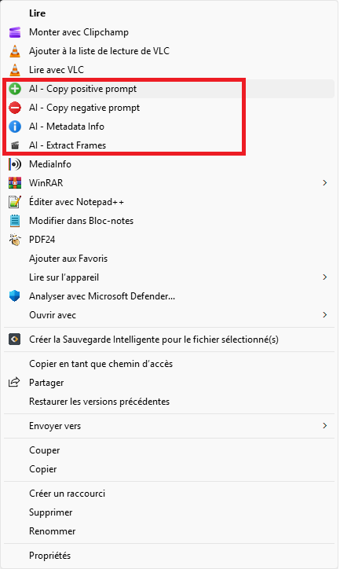
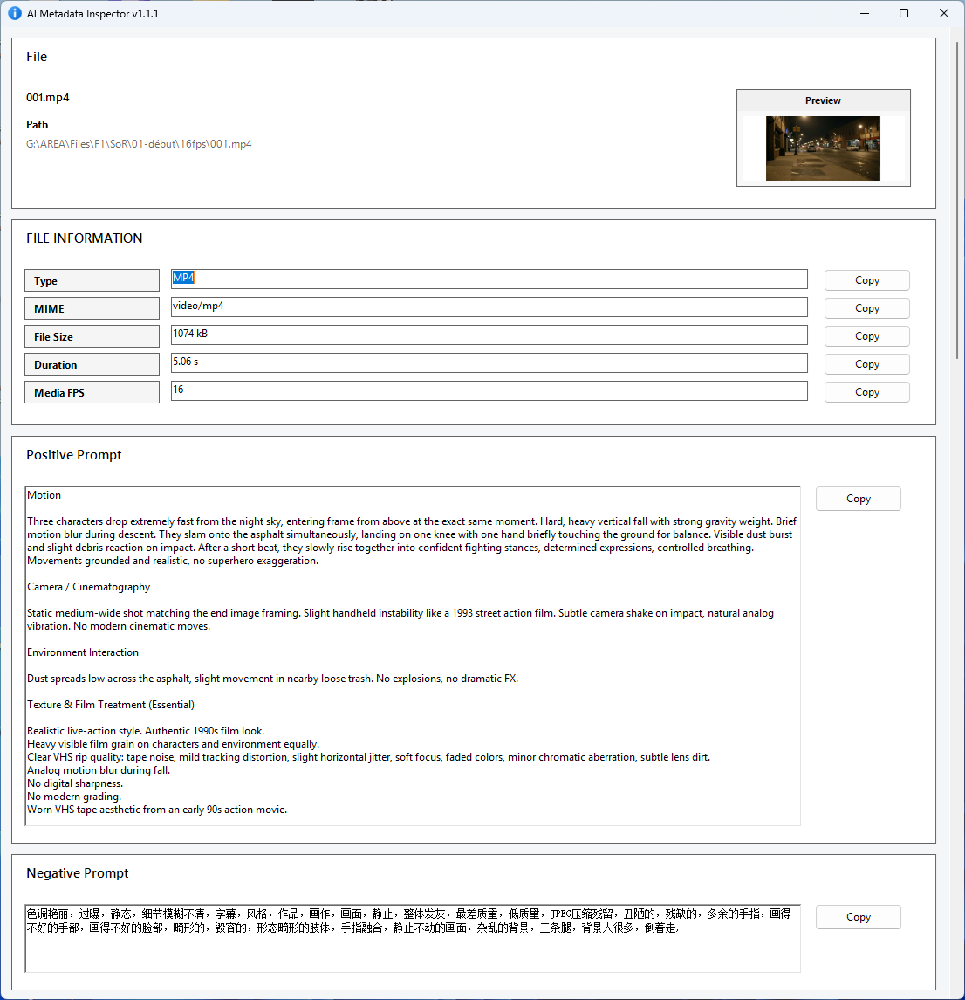
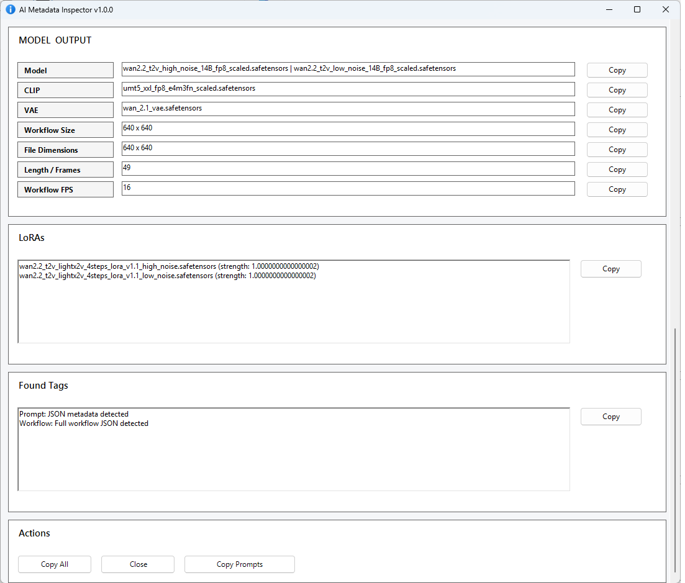
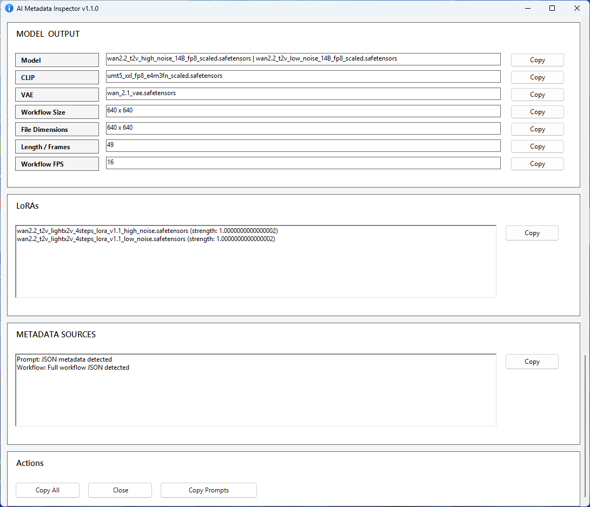

# AI Metadata Inspector

## 🔧 v1.1.1

- Fixed sampler pass display order in multi-pass workflows
- High-noise / generation pass is now shown first more reliably

Portable Windows tool to extract AI generation metadata and instantly reuse prompts from image and video files via right-click.

---

## ⚡ Quick Access (Right-click)

Access everything instantly from Windows Explorer:

- Copy positive prompt  
- Copy negative prompt  
- Open full AI metadata window  

👉 No need to open ComfyUI or dig through workflows

---

## 🖼️ AI Info Window

Clean and fast overview of prompts and generation settings:

---

## 🔍 Detailed Generation Data

Full breakdown including seed logic and sampler configuration:

---

## 🔁 Advanced Workflow Support

Multi-pass workflows are fully supported and clearly displayed:

---

## 🚀 Features

- Extract metadata from **PNG and MP4**
- Works with:
  - ComfyUI workflows  
  - WAN / img2vid pipelines  
  - A1111-style metadata (partial)
- Instant prompt copy via right-click
- Clean UI (no node graph mess)

### 🎯 Generation Data

- Seed (robust detection, including `0`)
- Noise seed
- Add noise / denoise
- Steps / CFG / sampler / scheduler
- Workflow resolution, FPS, length

### 🔁 Multi-Sampler Support (V1.1)

- Detects multiple sampler passes automatically  
- Works with advanced workflows (WAN, img2vid, etc.)

Each pass includes:
- Seed / Noise seed  
- Add noise  
- Steps / CFG  
- Sampler / Scheduler  
- Step range (start → end)  
- Leftover noise behavior  

---

## ⚡ Why this tool?

ComfyUI already allows loading images and workflows.

But this tool is built for speed and clarity:

- No need to launch ComfyUI  
- Works directly from Explorer  
- Much faster when browsing folders  
- Clear summary instead of complex graphs  
- Easily find seeds and settings  

👉 Think of it like **MediaInfo for AI-generated content**

---

## 🧠 Key Advantages

- Works even when Windows preview fails  
- Handles complex and multi-pass workflows  
- Extracts data from non-standard AI metadata  
- Fast (~1 second) and fully silent  

---

## 📦 Installation

Download the latest installer:

👉 https://github.com/Gaurox/AI-Metadata-Inspector/releases

Run the installer and you're ready to go.

---

## 🧩 Supported Formats

### 🖼️ PNG
- ComfyUI prompt JSON  
- A1111 metadata  

### 🎬 MP4
- ComfyUI workflow JSON  
- Multi-sampler workflows  
- WAN / img2vid supported  

---

## ⚙️ Tech Stack

- Python (embedded, no dependencies)
- ExifTool
- PowerShell (WinForms UI)
- VBS launcher
- Inno Setup

---

## 📝 Notes

- Optimized for ComfyUI workflows  
- Tested with WAN, Flux, LTX, Qwen, A1111  
- Compatibility may vary depending on metadata format  
- Windows 10 / 11 only  

---

## 📄 License

MIT License  

---

## 👤 Author

Gaurox
