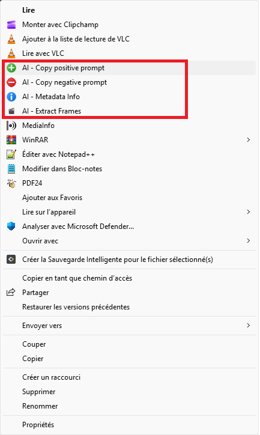
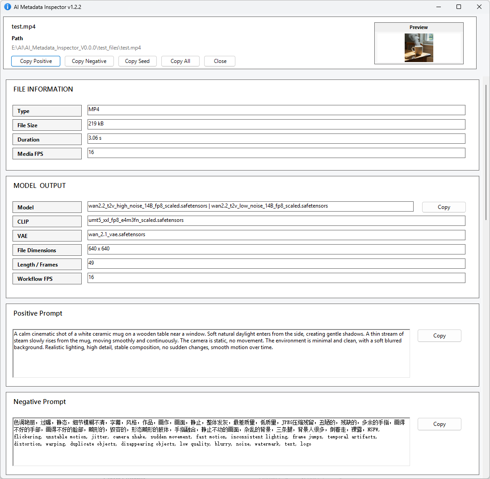
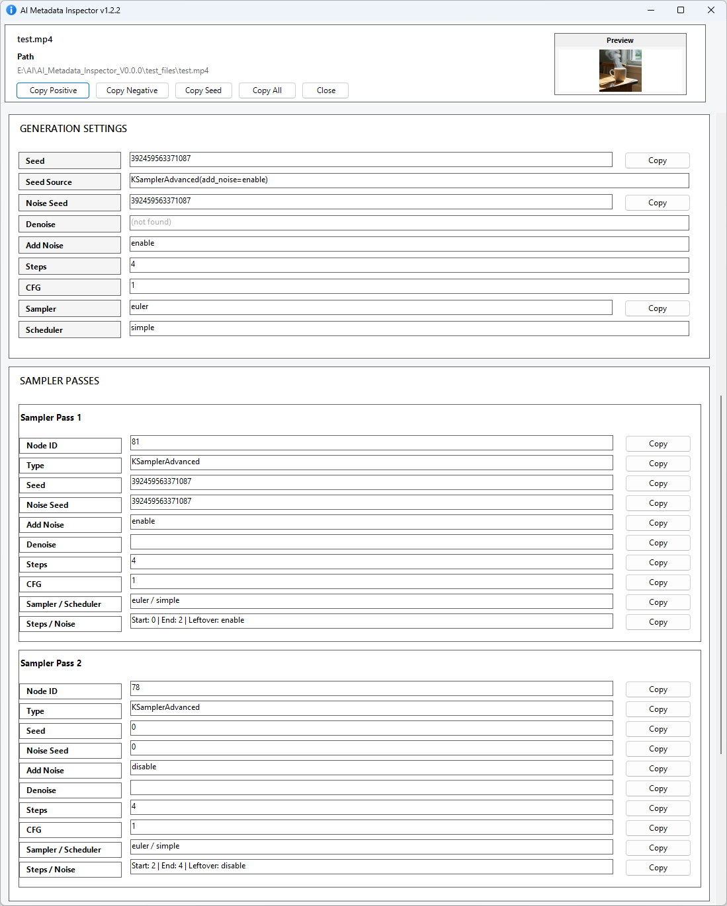
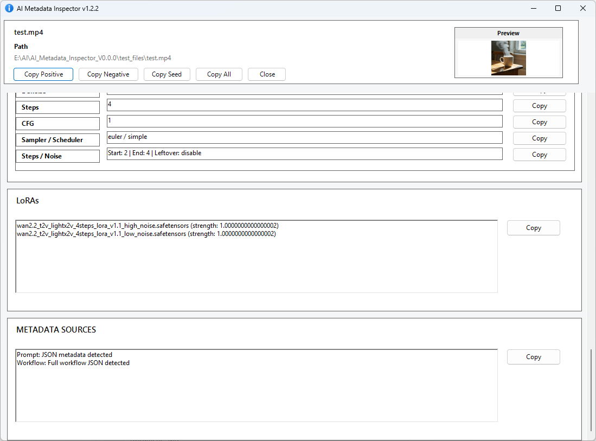

# AI Metadata Inspector

Official website: https://gaurox.dev/metadata-inspector/

Website screenshots note: the `screenshots/` folder in this repository is the source of truth for both the README and the Gaurox website page. When screenshots change, sync this folder to `E:\AI\Gaurox_Website\metadata-inspector\screenshots` with the shared sync script in `E:\AI\sync-gaurox-website-screenshots.ps1`.

## v1.3.1

Maintenance and performance release — internal improvements, updated bundled components, and faster metadata window opening.

## v1.3.0

- Faster right-click prompt copy path
- Improved MP4/PNG metadata detection, including more text tags and safer non-ASCII path handling
- Better ComfyUI workflow resolution for linked values, sampler passes, seeds, noise seed, denoise, CFG, scheduler, dimensions, and model data
- AI Info window refreshed with a cleaner, more compact layout, fixed top actions, preview support, and responsive window sizing
- PowerShell AI Info window fallback kept for embedded Python runtimes without Tkinter

Portable Windows tool to extract AI generation metadata and instantly reuse prompts from image and video files via right-click.

---

## Quick Access (Right-click)

Access everything instantly from Windows Explorer:

- Copy positive prompt  
- Copy negative prompt  
- Open full AI metadata window  
- Extract frames from MP4  

No need to open ComfyUI or dig through workflows

---

## AI Info Window

Clean and fast overview of prompts, model data, generation settings, sampler passes, and file preview:

---

## Detailed Generation Data

Full breakdown including seed logic, sampler configuration, model/output data, and detected metadata sources:

---

## Advanced Workflow Support

Multi-pass workflows are fully supported and clearly displayed:

---

## Frame Extraction (NEW in V1.2.0)

- Extract all frames from MP4 as PNG (lossless)
- Uses bundled FFmpeg (no dependency)
- Configurable output:
  - next to video
  - fixed folder
- Smart cleanup (no folder spam)
- Cancel anytime via GUI

---

## Features

- Extract metadata from **PNG and MP4**
- Works with:
  - ComfyUI workflows  
  - WAN / img2vid pipelines  
  - A1111-style metadata (partial)
- Instant prompt copy via right-click
- Clean AI Info window (no node graph mess)
- Fast path for copying prompts without opening the full info window

### Generation Data

- Seed (robust detection, including `0`)
- Noise seed
- Add noise / denoise
- Steps / CFG / sampler / scheduler
- Model / CLIP / VAE / LoRA detection
- File dimensions, video length, FPS, and frame count when available

### Multi-Sampler Support

- Detects multiple sampler passes automatically  
- Shows sampler pass details clearly
- Works with advanced and linked-node workflows

---

## Why this tool?

- No need to launch ComfyUI  
- Works directly from Explorer  
- Much faster when browsing folders  
- Clear summary instead of complex graphs  

Think of it like MediaInfo for AI-generated content

---

## Installation

Download the latest installer:

https://github.com/Gaurox/AI-Metadata-Inspector/releases

---

## Supported Formats

### PNG
- ComfyUI prompt JSON  
- A1111 metadata  

### MP4
- ComfyUI workflow JSON  
- Multi-sampler workflows  

---

## License

MIT License — see [LICENSE](LICENSE).

This software bundles third-party components (FFmpeg, ExifTool, Python) that are governed by their own licenses. See [THIRD_PARTY_NOTICES.md](THIRD_PARTY_NOTICES.md) for details.

---

## Security

To report a vulnerability, see [SECURITY.md](SECURITY.md).

SHA-256 checksums for each release installer are published alongside the download on the [Releases page](https://github.com/Gaurox/AI-Metadata-Inspector/releases).

---

## Author

Gaurox
